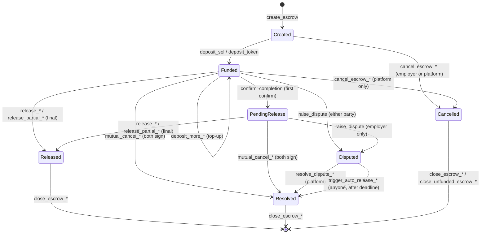
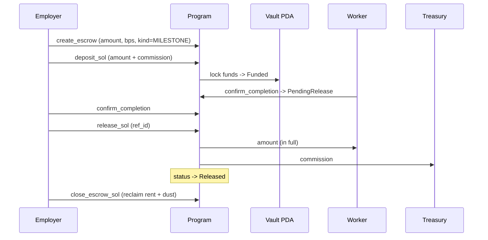
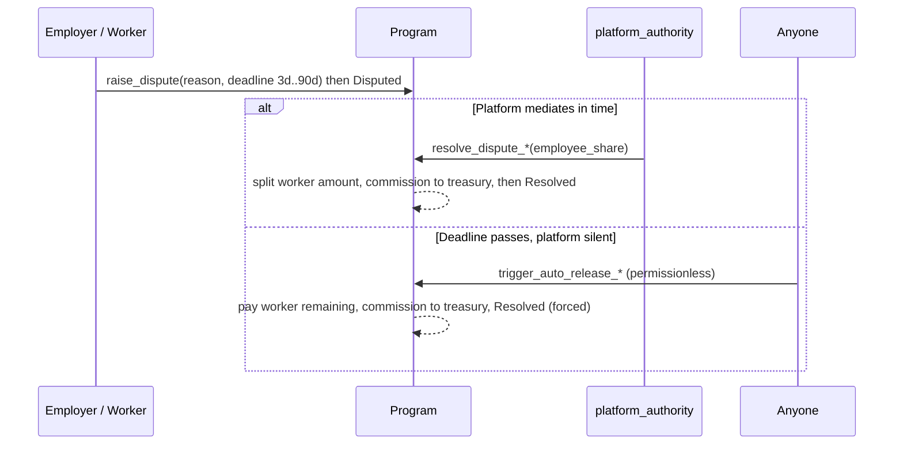
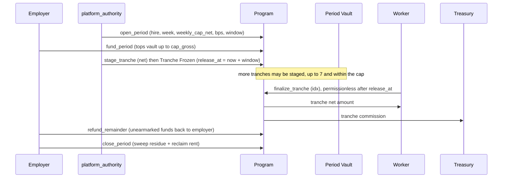

# Worqen Escrow

Trustless payment escrow and direct‑pay settlement for the [Worqen](https://worqen.com) job marketplace, written in Rust with the [Anchor](https://www.anchor-lang.com) framework on Solana. Employers lock funds in a program‑owned vault when they hire; workers are paid only after confirmation, with **platform‑mediated dispute resolution** and a permissionless **deadline safety net** so funds can never be stranded by an unresponsive platform. The program settles in native **SOL** and an **allowlisted set of SPL stablecoins** (USDC / USDT / EURC), charges a **fee‑on‑top commission** routed to a dedicated treasury, and also offers a non‑escrow **direct‑pay** path (single, batch, and tips) for trusted hires. For ongoing hourly work it adds a dedicated **weekly settlement engine (GWS — "guaranteed weekly settlement")**: the employer pre‑funds a capped weekly vault, the platform freezes each approved block of hours as a **tranche** with a review window, and every tranche pays out permissionlessly once its window elapses — with the same platform‑mediated dispute and deadline safety net, applied per tranche.

[](https://www.anchor-lang.com)
[](https://solana.com)
[](./LICENSE)
[](#8-security-model)

---

## 1. Devnet deployment

| Field | Value |
|---|---|
| **Program ID** | `6FtagT9Xm9b6eBHgDmxggam2KuiQbPYywUXnrs7B2gEJ` |
| **Cluster** | `devnet` — `https://api.devnet.solana.com` |
| **Program version** | `v1.0.0` (account schema version `1`) |
| **On‑chain IDL account** | `9TdbF5SFg5SQxyMfMAqtTU32FKUMFGCrocSQmAcvfiqb` |
| **ProgramData account** | `8nty8pKT9Pjnubi2kyXPte7SpiEpRG4FYQpn6AwYuNgQ` |
| **Upgrade authority** | `14AZtBTAyX9E9GsYryS5BEUT62mDeSDiwHkoKs9rEaSk` (devnet single key; mainnet must be a multisig) |
| **Config PDA** | `FoZkFXVjLSgeLDcZ98cahFSMUVTt7NfBDprKvpvtTTvN` (seed `"config"`) |
| **Treasury (`fee_recipient`)** | `49gGSC3hGZ2KFX4rFou9PJqjMchKQGNBpFQzpYhaNan1` (dedicated devnet treasury; mainnet must be a cold/multisig wallet) |
| **Explorer** | <https://explorer.solana.com/address/6FtagT9Xm9b6eBHgDmxggam2KuiQbPYywUXnrs7B2gEJ?cluster=devnet> |
| **Solscan** | <https://solscan.io/account/6FtagT9Xm9b6eBHgDmxggam2KuiQbPYywUXnrs7B2gEJ?cluster=devnet> |

> The canonical deployment manifest is [`devnet-deployment.json`](./devnet-deployment.json) — it is the source of truth for the program ID, PDAs, mints, and CI/deploy scripts.

---

## 2. Core concepts

### Two settlement engines

The program ships **two independent settlement engines** that share one Config, treasury, commission model, and pause switch:

1. **`Escrow`** — the per‑milestone / fixed‑price vault documented throughout this section (create → fund → confirm → release, plus disputes, direct‑pay, and batch pay). Its `escrow_kind` tag can also mark a lightweight `HOURLY`/`RETAINER` top‑up + draw‑down flow (see flow (c)).
2. **`HourlyPeriod`** — a dedicated **weekly hourly‑settlement (GWS)** account for ongoing hourly work: a capped, pre‑funded weekly vault whose approved blocks of hours are frozen as **tranches** and settled permissionlessly after a review window (see flow (j), the `HourlyPeriod` schema, and the hourly instruction table).

Both engines use the same four roles (**employer / employee / platform_authority / treasury**) and the same fee‑on‑top commission, but different account types and PDAs. The `HourlyPeriod` engine is **SPL‑token only**; the `Escrow` engine handles both native SOL and SPL tokens. The sections below describe the `Escrow` engine unless they say otherwise.

### The three‑party model + the treasury

Every escrow names three roles plus a separate fee destination:

| Role | What it is | Can it sign? | Does it hold money? |
|---|---|---|---|
| **employer** | The payer. Creates, funds, confirms, and (in `Created`) cancels the escrow. | Yes | No (funds live in the vault PDA) |
| **employee** | The worker. Receives the worker `amount` in full. | Yes (confirm, self‑release after both confirm) | Receives payouts |
| **platform_authority** | Per‑escrow **hot ops key** (the Worqen backend). Resolves disputes, cancels funded escrows, force/auto‑releases, rotates keys. | Yes | **No — it never receives commission** |
| **fee_recipient** | The **treasury** (`Config.fee_recipient`, snapshotted onto each escrow at create). Receives all commission. | **Never signs** | Receives commission only |

The strict separation between the **ops key** (`platform_authority`, hot, signs) and the **treasury** (`fee_recipient`, cold, never signs) means a compromise of the operations key cannot redirect funds to itself.

### The global Config PDA

A singleton account at PDA `[b"config"]` holds platform‑wide state:

- **Mint allowlist** — up to 30 SPL mints permitted for escrow and direct‑pay. Native SOL is always allowed and is not stored.
- **Pause kill‑switch** — when `paused = true`, it blocks **only new money entering the system** (`create_escrow`, `deposit_*`, `pay_with_commission_*`, batch pay). It can **never** block release, dispute, auto‑release, settle, or close — so a pause can never strand user funds.
- **Default commission** (`default_commission_bps`) and the **treasury** (`fee_recipient`).
- **Two‑step admin handoff** — `update_config(new_pending_authority)` then `accept_authority` (signed by the pending key). Prevents handing the keys to a typo'd address.

### Fee‑on‑top commission model

Commission is **on top of** the worker's pay, never deducted from it. The worker always receives the full `amount`.

```
employer deposits  =  amount  +  commission
worker receives    =  amount                  (in full)
treasury receives  =  commission              ( = amount * bps / 10000, floored )
```

| Tier | bps | Rate | Notes |
|---|---|---|---|
| Standard | `500` | 5% | `Escrow::DEFAULT_COMMISSION_RATE_BPS` |
| Prime (subscriber) | `150` | 1.5% | `Escrow::PRIME_COMMISSION_RATE_BPS` — backend passes the effective bps per call |
| Tip | `200` | 2% | `Escrow::TIP_COMMISSION_RATE_BPS` |
| **Hard cap** | `1000` | **10%** | `Escrow::MAX_COMMISSION_RATE_BPS` — enforced on‑chain; any higher rate is rejected |

The tier constants are informational; the **effective `bps` is supplied per instruction by the backend** and only the 10% cap is enforced on chain. Freelancers pay nothing — the employer pays the fee.

### Per‑milestone escrow + grouping

Escrows are **per‑milestone**, not per‑hire. A multi‑milestone hire creates one escrow per milestone, linked off‑chain by `escrow_group_id` (an off‑chain SHA‑256 of the hire id), with `sequence_in_group` / `total_in_group` so an indexer can collect all milestones of a hire without an off‑chain join. Ungrouped escrows set the group id to zero bytes and the sequence/total to 0.

An `escrow_kind` tag (`u8`, not a closed enum so new kinds can be added without a schema migration) classifies the product flow: `MILESTONE = 0`, `HOURLY = 1`, `RETAINER = 2`, `OTHER = 255`. This tag lives on the `Escrow` account; the dedicated weekly `HourlyPeriod` engine (flow (j)) is a separate account type, not an `escrow_kind`.

### PDAs

| PDA | Seeds | Holds |
|---|---|---|
| **Escrow** | `[b"escrow", escrow_id]` | The escrow state account (`escrow_id` = random 32 bytes from the backend) |
| **Vault** | `[b"vault", escrow_account_key]` | The locked funds — native SOL directly, or an SPL ATA owned by the escrow PDA |
| **Config** | `[b"config"]` | The singleton global config |

> **Bump gotcha:** SOL CPIs from the vault sign with `vault_bump`; SPL token CPIs sign with `escrow.bump` (the escrow PDA is the ATA authority). Mixing them surfaces as "unauthorized signer".

### Escrow lifecycle / state machine



`Released`, `Resolved`, and `Cancelled` are terminal. Rent is reclaimed by closing a terminal escrow.

---

## 3. Flows

### (a) Fixed‑price escrow — happy path



`release_*` is authorized for: the **employer** (after `employer_confirmed`), the **platform_authority**, or the **worker** once *both* parties have confirmed (covers the "employer confirmed then went silent" case without a dispute).

### (b) Multi‑milestone

The backend creates N escrows sharing one `escrow_group_id`, each with `sequence_in_group ∈ [1, total_in_group]`. Each milestone funds, confirms, and releases independently following flow (a). Indexers reassemble the hire from the group id.

### (c) Escrowed hourly / retainer (top‑up + draw‑down)

For ongoing work, create with `escrow_kind = HOURLY` or `RETAINER`, fund a starting block, then:

- **Top up** a `Funded` escrow with `deposit_more_sol` / `deposit_more_token` — raises `amount`, recomputes commission on the new total, and charges only the delta.
- **Draw down** with `release_partial_sol` / `release_partial_token` per approved worklog or invoice. Each partial pays the worker `amount` plus the *delta* of cumulative commission, so the sum of partial commissions equals a single full‑release commission for the same total. A non‑final partial must leave the vault at 0 or above the rent‑exempt minimum (else `PartialReleaseLeavesDust`); the final slice drains the vault and flips status to `Released`. `ref_id` on each release ties a draw‑down to its off‑chain worklog/invoice.

### (d) Direct pay (non‑escrow, fee‑on‑top)

For trusted hires and approved‑invoice settlement, `pay_with_commission_sol` / `pay_with_commission_token` atomically pays the worker the full `amount` and a commission on top to the treasury in one transaction — **no escrow, no lock, no state persisted**. Indexers rely on the `DirectPaymentMade` event. Subject to the pause switch and (for tokens) the mint allowlist.

### (e) Batch payout to many recipients

`batch_pay_with_commission_sol` / `batch_pay_with_commission_token` fan out a single fee‑on‑top direct payment to **up to 16 recipients** in one atomic transaction (team payouts, referral fees). Recipient accounts/ATAs are passed via `remaining_accounts`, positionally aligned with the `amounts` vector; one commission on the total goes to the treasury. No recipient may equal the payer.

### (f) Dispute → resolve, and the auto‑release safety net



`dispute_deadline` is **mandatory** and bounded to `[now + 3 days, now + 90 days]`. The 3‑day minimum guarantees the platform always has time to mediate before anyone can force‑resolve (this closes a self‑dispute‑then‑instant‑payout hole). After the deadline, **anyone** can call `trigger_auto_release_*` to pay the worker, so an unresponsive platform can never strand a worker's funds. As of v1.1.0 the platform **retains** its commission on a resolved or force-resolved dispute (routed to the treasury, never to the ops key). In `Funded` either party may dispute; in `PendingRelease` only the employer may (the worker is already committed by the prior confirm).

### (g) Mutual cancel (amicable settle, both sign)

`mutual_cancel_sol` / `mutual_cancel_token` lets the **employer and employee both sign** to split a non‑terminal (`Funded` / `PendingRelease`) escrow without a dispute or platform involvement. `employee_share` (≤ remaining worker amount) goes to the worker; the remainder and any dust go to the employer, while the commission is retained by the treasury. Status → `Resolved`.

### (h) Cancel + close / close‑unfunded (rent recovery)

- **Cancel** (`cancel_escrow_*`): in `Created`, the employer or platform may cancel; once `Funded`, **only the platform** may cancel (the employer must dispute instead of unilaterally reclaiming funds the worker may have started against). The worker deposit refunds to the employer; any commission collected while funded is retained by the treasury.
- **Close** (`close_escrow_*`): on a terminal escrow, employer **or** platform sweeps any vault dust and refunds the escrow account's rent (~0.005 SOL) to the employer.
- **Close‑unfunded** (`close_unfunded_escrow_*`): reclaims rent on a `Cancelled` escrow that was **never funded** (`funded_at == 0`); for SOL no vault is involved, for tokens no vault ATA was ever created.

### (i) Tips

A tip is just a direct payment at the tip rate: `pay_with_commission_*` with `commission_bps = 200` (2%). No escrow account is involved.

### (j) Hourly weekly settlement — GWS (`HourlyPeriod`)

For ongoing hourly engagements, the dedicated **`HourlyPeriod`** engine gives the worker a *guaranteed weekly settlement*: the employer pre‑funds a capped vault for the week, and each approved block of hours is **frozen** on‑chain for a review window, then paid out automatically. One period account exists per `(hire_id, period_index)` (one week), is **SPL‑token only** (USDC / USDT / EURC), and holds up to **7 tranches**.



**Cap and funding.** `weekly_cap_net` is the most *net* pay the worker can earn that week; the vault is funded to `cap_gross = weekly_cap_net + commission(weekly_cap_net)`. `fund_period` (employer signs) tops the vault up to `cap_gross`. `pull_fund_period` does the same **permissionlessly** by pulling from the employer's token account through a pre‑approved **SPL delegate** (PDA `[b"delegate_auth"]`), so the backend can keep a period funded without the employer signing each time. `raise_weekly_cap` (employer or platform) can only **increase** the cap, and never below the already‑staged total.

**Tranches.** `stage_tranche` (platform signs) freezes a `net` block of hours: it books the marginal commission, sets `release_at = now + review_window_secs` (default **7 days**, max 30), and requires the vault to already cover every live tranche plus this one (`VaultUnderfunded` otherwise). A period holds at most **7** tranches.

**Settlement.** After `release_at`, **anyone** can call `finalize_tranche` to pay the worker that tranche's net amount and route its commission to the treasury — the permissionless guarantee that approved work is always paid, even if the platform goes quiet.

**Disputes.** Before a tranche's window elapses, the employer, worker, or platform can `raise_hourly_dispute(idx, deadline, reason)` (deadline bounded to `[now + 3 days, now + 90 days]`), moving that tranche to `Disputed`. The platform then `resolve_hourly_tranche(idx, employee_share)`: the worker gets `employee_share`, the treasury keeps commission **proportional to that share**, and the employer is refunded the remainder (the unpaid worker amount plus the un‑earned commission). If the platform never acts, after the deadline **anyone** can `trigger_hourly_auto_release(idx)` to pay the worker the full tranche (commission to treasury) — the same platform‑failure safety net as the milestone escrow, applied per tranche.

**Wind‑down.** `refund_remainder` (employer or platform) returns any vault funds **not** earmarked by a live tranche to the employer at week's end. `close_period` (employer or platform, once no tranche is live) sweeps any residue to the employer, closes the account, and refunds its rent.

---

## 4. Instruction reference (44 total)

### Config (5)

| Instruction | Who signs | Precondition | Effect |
|---|---|---|---|
| `init_config` | future admin | Config PDA not yet initialized; `fee_recipient != default`; `bps <= 1000`; <= 30 mints | Creates singleton Config; signer becomes `authority` |
| `update_config` | `authority` | — | Sets any of fee_recipient / default bps / paused / pending_authority (each `None` left unchanged) |
| `accept_authority` | `pending_authority` | a pending handoff exists | Completes two‑step admin handoff |
| `add_allowed_mint` | `authority` | mint not present; list `< 30` | Adds an SPL mint to the allowlist |
| `remove_allowed_mint` | `authority` | mint present | Removes an SPL mint from the allowlist |

### Escrow lifecycle (5)

| Instruction | Who signs | Precondition | Effect |
|---|---|---|---|
| `create_escrow` | employer | not paused; mint allowed; `amount > 0`; `bps <= 1000`; parties distinct; native/mint consistent; valid group seq | Creates escrow PDA in `Created`; snapshots `fee_recipient`, `escrow_kind`, `terms_hash` |
| `deposit_sol` | employer | `Created`; native | Transfers `amount + commission` to vault → `Funded` |
| `deposit_token` | employer | `Created`; SPL; mint matches | Transfers `amount + commission` to vault ATA → `Funded` |
| `confirm_completion` | employer or employee | `Funded` or `PendingRelease`; not already confirmed | Marks confirm; first confirm advances `Funded → PendingRelease` |
| `update_platform_authority` | current `platform_authority` | not `Disputed`; new key != current, employer, or employee | Rotates the per‑escrow ops key |

### Payout (4)

| Instruction | Who signs | Precondition | Effect |
|---|---|---|---|
| `release_sol` | employer (confirmed) / platform / worker (both confirmed) | `Funded` or `PendingRelease`; native | Pays worker remaining `amount`, drains rest to treasury → `Released` |
| `release_token` | same as above | `Funded` or `PendingRelease`; SPL | Token variant of `release_sol` |
| `release_partial_sol` | employer / platform / worker (both confirmed) | `Funded` or `PendingRelease`; native; `amount <= remaining`; no sub‑rent dust | Pays a slice + proportional commission; final slice → `Released` |
| `release_partial_token` | same as above | `Funded` or `PendingRelease`; SPL | Token variant of `release_partial_sol` |

### Dispute (5)

| Instruction | Who signs | Precondition | Effect |
|---|---|---|---|
| `raise_dispute` | employer or employee (employer‑only in `PendingRelease`) | `Funded`/`PendingRelease`; deadline in `[now+3d, now+90d]`; reason <= 256 B | Freezes funds → `Disputed` |
| `resolve_dispute_sol` | `platform_authority` | `Disputed`; native; `employee_share <= remaining` | Splits remaining worker amount; commission retained by treasury → `Resolved` |
| `resolve_dispute_token` | `platform_authority` | `Disputed`; SPL | Token variant |
| `trigger_auto_release_sol` | **anyone** (pays gas) | `Disputed`; native; `now >= dispute_deadline` | Pays worker remaining; commission retained by treasury → `Resolved (forced)` |
| `trigger_auto_release_token` | **anyone** | `Disputed`; SPL; deadline reached | Token variant |

### Cancel & close (6)

| Instruction | Who signs | Precondition | Effect |
|---|---|---|---|
| `cancel_escrow_sol` | employer (in `Created`) or platform (in `Created`/`Funded`) | `Created` or `Funded`; native; reason <= 128 B | Refunds worker deposit to employer; commission retained by treasury if funded → `Cancelled` |
| `cancel_escrow_token` | same as above | `Created` or `Funded`; SPL | Token variant |
| `close_escrow_sol` | employer or platform | terminal status; native | Sweeps dust + refunds rent to employer; closes account |
| `close_escrow_token` | employer or platform | terminal status; SPL; vault empty | Sweeps residual tokens + refunds all rent; closes |
| `close_unfunded_escrow_sol` | employer or platform | `Cancelled` and `funded_at == 0`; native | Reclaims account rent (no vault) |
| `close_unfunded_escrow_token` | employer or platform | `Cancelled` and `funded_at == 0`; SPL | Reclaims rent (no vault ATA) |

### Extended flows (4)

| Instruction | Who signs | Precondition | Effect |
|---|---|---|---|
| `deposit_more_sol` | employer | `Funded`; native | Raises `amount`, recomputes commission on new total, deposits the delta |
| `deposit_more_token` | employer | `Funded`; SPL | Token variant |
| `mutual_cancel_sol` | employer **and** employee | `Funded`/`PendingRelease`; native; `employee_share <= remaining` | Amicable split; commission retained by treasury → `Resolved` |
| `mutual_cancel_token` | employer **and** employee | `Funded`/`PendingRelease`; SPL | Token variant |

### Direct pay — no escrow (4)

| Instruction | Who signs | Precondition | Effect |
|---|---|---|---|
| `pay_with_commission_sol` | payer | not paused; `amount > 0`; `bps <= 1000`; no self‑pay | Pays worker `amount` + commission on top to treasury (atomic) |
| `pay_with_commission_token` | payer | not paused; mint allowed; SPL | Token variant |
| `batch_pay_with_commission_sol` | payer | not paused; 1–16 recipients; `len(amounts)==recipients`; no self‑pay | Fans out to many recipients; one commission on total to treasury |
| `batch_pay_with_commission_token` | payer | not paused; mint allowed; 1–16 ATAs | Token variant |

### Hourly weekly settlement — `HourlyPeriod` (11, SPL only)

| Instruction | Who signs | Precondition | Effect |
|---|---|---|---|
| `open_period` | payer (backend) | not paused; mint allowed; `weekly_cap_net > 0`; `bps <= 1000`; parties distinct; `review_window ∈ (0, 30d]` | Creates the `HourlyPeriod` PDA + vault/employee/treasury ATAs → `Open` |
| `fund_period` | employer | `Open`/`Funded`/`Active` | Moves the shortfall up to `cap_gross` from the employer into the vault; first fund → `Funded` |
| `pull_fund_period` | **anyone** | `Open`/`Funded`/`Active`; employer ATA delegated to `[b"delegate_auth"]` | Permissionless top‑up to `cap_gross` via the SPL delegate |
| `raise_weekly_cap` | employer or platform | `Open`/`Funded`/`Active`; `new >= cap` and `>= total_staged` | Raises `weekly_cap_net` (can never lower it) |
| `stage_tranche` | `platform_authority` | `Funded`/`Active`; `< 7` tranches; `total_staged + net <= cap`; vault covers live + new | Freezes a tranche (`release_at = now + window`); first stage → `Active` |
| `finalize_tranche` | **anyone** | tranche `Frozen`; `now >= release_at` | Pays worker the tranche net + commission to treasury → tranche `Finalized` |
| `raise_hourly_dispute` | employer, employee, or platform | tranche `Frozen`; `now < release_at`; deadline in `[now+3d, now+90d]`; reason <= 256 B | Freezes the tranche → `Disputed` |
| `resolve_hourly_tranche` | `platform_authority` | tranche `Disputed`; `employee_share <= tranche` | Splits the tranche; treasury keeps commission on the paid share, employer refunded the rest → `Resolved` |
| `trigger_hourly_auto_release` | **anyone** | tranche `Disputed`; `now >= dispute_deadline` | Pays worker the full tranche (commission to treasury) → `Resolved (forced)` |
| `refund_remainder` | employer or platform | any status | Refunds vault funds not earmarked by a live tranche to the employer → `Refunded` (or `Settling` if earmarks remain) |
| `close_period` | employer or platform | no live (`Frozen`/`Disputed`) tranche | Sweeps residual tokens to employer, closes the account, refunds rent |

---

## 5. Account schemas

### `Config` (PDA `[b"config"]`)

| Field | Type | Meaning |
|---|---|---|
| `version` | `u8` | Config schema version (`1`) |
| `authority` | `Pubkey` | Admin (multisig on mainnet) — pause, allowlist, default fee, treasury |
| `pending_authority` | `Pubkey` | Pending admin during a two‑step handoff (`default` = none) |
| `fee_recipient` | `Pubkey` | Treasury that receives commission; snapshotted onto each escrow |
| `default_commission_bps` | `u16` | Informational default rate (`500`) |
| `paused` | `bool` | Kill‑switch — blocks new money only |
| `allowed_mints` | `Vec<Pubkey>` | Up to 30 permitted SPL mints (SOL always allowed, not listed) |
| `bump` | `u8` | Config PDA bump |
| `reserved` | `[u8; 64]` | Forward‑compat padding |

### `Escrow` (PDA `[b"escrow", escrow_id]`)

| Field | Type | Meaning |
|---|---|---|
| `version` | `u8` | Account schema version (`ESCROW_ACCOUNT_VERSION = 1`) |
| `escrow_id` | `[u8; 32]` | Random unique id from backend; PDA seed |
| `escrow_group_id` | `[u8; 32]` | Links milestones of one hire (zero = ungrouped) |
| `sequence_in_group` | `u8` | 1‑indexed position in group (0 if ungrouped) |
| `total_in_group` | `u8` | Total milestones in group (0 if ungrouped) |
| `employer` | `Pubkey` | Payer wallet |
| `employee` | `Pubkey` | Worker wallet |
| `platform_authority` | `Pubkey` | Per‑escrow ops/signing key (does **not** receive commission) |
| `amount` | `u64` | Worker payment in full (fee is on top) |
| `commission_amount` | `u64` | `amount * bps / 10000` |
| `commission_rate_bps` | `u16` | Commission rate in basis points |
| `released_to_employee` | `u64` | Cumulative amount paid via partials |
| `token_mint` | `Pubkey` | SPL mint, or System Program ID for SOL |
| `is_native` | `bool` | `true` = SOL, `false` = SPL |
| `status` | `EscrowStatus` | `Created`/`Funded`/`PendingRelease`/`Released`/`Disputed`/`Resolved`/`Cancelled` |
| `employer_confirmed` | `bool` | Employer confirmed completion |
| `employee_confirmed` | `bool` | Employee confirmed completion |
| `created_at` / `funded_at` / `completed_at` | `i64` | Lifecycle timestamps |
| `auto_release_at` | `i64` | Reserved future auto‑release deadline (validated at create; not read in v1) |
| `release_initiator` | `Pubkey` | Who triggered the release |
| `dispute_reason` | `[u8; 256]` | UTF‑8 dispute reason |
| `dispute_raised_by` / `dispute_raised_at` | `Pubkey` / `i64` | Who/when a dispute was raised |
| `dispute_deadline` | `i64` | After this, anyone may force‑resolve |
| `dispute_resolved_by` / `dispute_resolved_at` | `Pubkey` / `i64` | Who/when resolved |
| `employee_share_resolved` / `employer_share_resolved` | `u64` | Split amounts on resolution |
| `cancellation_reason` | `[u8; 128]` | UTF‑8 cancel reason |
| `cancelled_by` | `Pubkey` | Who cancelled |
| `bump` | `u8` | Escrow PDA bump (token CPI authority) |
| `vault_bump` | `u8` | Vault PDA bump (SOL CPI authority) |
| `escrow_kind` | `u8` | Product‑flow tag (`MILESTONE`/`HOURLY`/`RETAINER`/`OTHER`) |
| `fee_recipient` | `Pubkey` | Treasury snapshot at create |
| `terms_hash` | `[u8; 32]` | Optional tamper‑evident hash of agreed terms/invoice (zero = none) |
| `reserved` | `[u8; 64]` | Forward‑compat padding |

### `HourlyPeriod` (PDA `[b"hourly", hire_id, period_index]`)

The weekly hourly‑settlement account (GWS). **SPL‑token only** — there is no native‑SOL variant.

| Field | Type | Meaning |
|---|---|---|
| `version` | `u8` | Schema version (`HOURLY_PERIOD_VERSION = 1`) |
| `hire_id` | `[u8; 32]` | Off‑chain hire id; PDA seed |
| `period_index` | `u32` | Week index within the hire; PDA seed |
| `employer` / `employee` | `Pubkey` | Payer / worker wallets |
| `platform_authority` | `Pubkey` | Ops key (opens/stages/resolves; never holds fees) |
| `fee_recipient` | `Pubkey` | Treasury, snapshotted from Config |
| `token_mint` | `Pubkey` | SPL mint for the period |
| `bump` / `vault_bump` | `u8` | Period PDA bump / reserved |
| `weekly_cap_net` | `u64` | Max net worker pay for the week |
| `commission_rate_bps` | `u16` | Commission rate (≤ 10%) |
| `funded_amount` | `u64` | Tokens funded into the vault so far |
| `released_net` | `u64` | Cumulative net paid to the worker |
| `total_staged_net` | `u64` | Cumulative net staged across all tranches |
| `tranches` | `[Tranche; 7]` | Fixed array of up to 7 tranches |
| `tranche_count` | `u8` | Tranches staged (append‑only, ≤ 7) |
| `review_window_secs` | `i64` | Per‑tranche review window (default 7d, max 30d) |
| `created_at` / `funded_at` / `period_end_at` / `completed_at` | `i64` | Lifecycle timestamps |
| `status` | `HourlyStatus` | `Open`/`Funded`/`Active`/`Settling`/`Closed`/`Refunded`/`Cancelled` |
| `reserved` | `[u8; 64]` | Forward‑compat padding |

Each **`Tranche`** carries: `amount` (net), `commission`, `staged_at`, `release_at`, `dispute_deadline`, and `status` (`Empty`/`Frozen`/`Disputed`/`Finalized`/`Resolved`). A tranche is *live* while `Frozen` or `Disputed`; those amounts are the vault's earmarked liabilities.

### Events

`EscrowCreated`, `EscrowFunded`, `CompletionConfirmed`, `EscrowReleased` (carries `ref_id`, `is_partial`, `remaining_worker_amount`), `DisputeRaised`, `DisputeResolved` (carries `forced`), `EscrowCancelled`, `PlatformAuthorityRotated`, `DirectPaymentMade`, `ConfigUpdated`, `MintAllowlistChanged`, `EscrowToppedUp`, `BatchPaymentMade`, `EscrowSettled`. The hourly engine adds `HourlyPeriodOpened`, `HourlyPeriodFunded`, `HourlyCapRaised`, `TrancheStaged`, `TrancheFinalized` (carries `forced`), `HourlyDisputeRaised`, `HourlyTrancheResolved` (carries `forced` + the treasury/refund split), `HourlyRemainderRefunded`, and `HourlyPeriodClosed`.

Direct‑pay and batch‑pay persist no state — indexers rely entirely on `DirectPaymentMade` / `BatchPaymentMade`.

---

## 6. Error codes

| Code | Name | Meaning |
|---|---|---|
| 6000 | `InvalidStatus` | Escrow status invalid for this operation |
| 6001 | `Unauthorized` | Signer not authorized for this action |
| 6002 | `NotNativeEscrow` | Operation requires a native SOL escrow |
| 6003 | `NotTokenEscrow` | Operation requires an SPL token escrow |
| 6004 | `AlreadyConfirmed` | Party already confirmed completion |
| 6005 | `ReleaseNotAuthorized` | Release requires employer confirmation or platform authority |
| 6006 | `InvalidAmount` | Invalid amount specified |
| 6007 | `DisputeReasonTooLong` | Dispute reason exceeds 256 bytes |
| 6008 | `InvalidTokenMint` | Token mint does not match the escrow |
| 6009 | `InsufficientFunds` | Insufficient funds in vault |
| 6010 | `InvalidEmployeeShare` | Employee share exceeds remaining worker amount |
| 6011 | `InvalidCommissionRate` | Commission rate exceeds the 10% cap |
| 6012 | `EmployeeIsEmployer` | Employee and employer must differ |
| 6013 | `PlatformAuthorityConflict` | Platform authority must differ from employer and employee |
| 6014 | `CancellationReasonTooLong` | Cancellation reason exceeds 128 bytes |
| 6015 | `AutoReleaseNotReached` | Auto‑release deadline not reached |
| 6016 | `AutoReleaseNotConfigured` | Auto‑release not configured for this escrow |
| 6017 | `DisputeDeadlineNotReached` | Dispute deadline not reached |
| 6018 | `PartialReleaseTooLarge` | Partial release exceeds remaining worker amount |
| 6019 | `InvalidGroupSequence` | `sequence_in_group` out of `[1, total_in_group]` |
| 6020 | `InvalidNewPlatformAuthority` | New platform authority equals employer or employee |
| 6021 | `InvalidAutoReleaseTime` | `auto_release_at` must be in the future |
| 6022 | `InvalidDisputeDeadline` | `dispute_deadline` must be in the future |
| 6023 | `SelfPaymentNotAllowed` | Self‑payment is not allowed |
| 6024 | `DisputeLockedAfterConfirm` | Dispute locked once a party confirmed (worker can't dispute in `PendingRelease`) |
| 6025 | `DisputeDeadlineRequired` | `dispute_deadline` must be > 0 (zero would disable the safety net) |
| 6026 | `DisputeDeadlineTooLong` | Exceeds the 90‑day max window |
| 6027 | `EmployerCancelAfterFundedDisallowed` | Employer can't cancel a funded escrow; must dispute |
| 6028 | `AuthorityRotationDuringDispute` | Cannot rotate `platform_authority` while `Disputed` |
| 6029 | `EscrowNotTerminal` | Escrow is not terminal; cannot close |
| 6030 | `AutoReleaseTooFar` | `auto_release_at` exceeds the max window (1 year) |
| 6031 | `IsNativeMintMismatch` | `is_native` and `token_mint` inconsistent |
| 6032 | `PartialReleaseLeavesDust` | Partial would leave vault below rent‑exempt minimum |
| 6033 | `VaultNotEmpty` | Token vault non‑empty; transfer remaining tokens before closing |
| 6034 | `DisputeWindowTooShort` | `dispute_deadline` sooner than the 3‑day minimum |
| 6035 | `MintNotAllowed` | Token mint not on the platform allowlist |
| 6036 | `ProgramPaused` | New escrows/deposits/direct payments blocked while paused |
| 6037 | `InvalidFeeRecipient` | `fee_recipient` account does not match the escrow/config |
| 6038 | `NoPendingAuthority` | No pending authority to accept |
| 6039 | `PendingAuthorityMismatch` | Signer is not the pending authority |
| 6040 | `EscrowWasFunded` | Escrow was funded; use `close_escrow_*` instead |
| 6041 | `MintAllowlistFull` | Allowlist full or mint already present |
| 6042 | `TooManyRecipients` | More than 16 recipients in a batch |
| 6043 | `RecipientCountMismatch` | Recipient count != `amounts` length |
| 6044 | `EmptyBatch` | Batch must have at least one recipient |
| 6045 | `TopUpNotFunded` | Top‑up requires the escrow to be `Funded` |
| 6046 | `WeeklyCapExceeded` | Staged amount would exceed the weekly cap |
| 6047 | `TrancheLimitReached` | Weekly tranche limit (7) reached |
| 6048 | `TrancheNotFrozen` | Tranche is not in `Frozen` status |
| 6049 | `TrancheNotDisputed` | Tranche is not in `Disputed` status |
| 6050 | `TrancheWindowNotElapsed` | Tranche review window has not elapsed |
| 6051 | `DisputeWindowClosed` | Cannot dispute after the tranche review window has opened |
| 6052 | `InvalidTrancheIndex` | Tranche index out of bounds |
| 6053 | `VaultUnderfunded` | Vault balance insufficient to back this earmark |
| 6054 | `HourlyEmployeeShareExceedsTranche` | `employee_share` exceeds the tranche amount |
| 6055 | `CapCannotDecrease` | Weekly cap can only be raised, never lowered |
| 6056 | `CapBelowStaged` | Weekly cap cannot drop below the already‑staged total |
| 6057 | `PeriodFullyFunded` | Period vault already funded to `cap_gross` |
| 6058 | `HourlyPeriodNotTerminal` | Period has live earmarks; cannot close |

---

## 7. Money math

```rust
commission           = floor(amount * commission_rate_bps / 10000)   // u128 intermediate
total_deposit        = amount + commission                            // checked add
remaining_worker     = amount - released_to_employee                  // saturating
remaining_commission = commission_amount - floor(released_to_employee * bps / 10000)
```

All SOL payout/refund/dispute/settle paths **drain the vault to its actual balance**, not the recorded amounts. This sweeps any dust someone sent to the vault directly and guarantees the vault ends at exactly 0 — Solana rejects an account left below the rent‑exempt minimum but above zero, so draining to actual balance is what makes the program dust‑DoS safe.

---

## 8. Security model

- **Role separation.** The treasury (`fee_recipient`) **never signs** — it is a cold, receive‑only key. The per‑escrow `platform_authority` is a **hot ops key that never holds fees**, decoupled from the treasury. The commission destination is snapshotted at create time, so a later Config change can never re‑route an in‑flight escrow.
- **Upgrade authority.** On devnet a single file key (acceptable for devnet); **on mainnet the upgrade authority and Config authority must be a Squads multisig / HSM** (transfer post‑deploy with `solana program set-upgrade-authority`). Config admin uses a **two‑step handoff** so the keys can never be sent to a wrong address.
- **Drain‑actual‑balance.** All SOL release/resolve/cancel/settle paths transfer the vault's *real* lamport balance, defeating dust‑deposit DoS that would otherwise strand a vault below the rent‑exempt minimum.
- **Mint allowlist.** Only SOL plus an admin‑curated set of SPL mints are accepted. **Accepted‑stablecoin freeze risk:** USDC/USDT/EURC carry an issuer freeze authority; a frozen vault ATA or recipient ATA could block a transfer. The allowlist limits exposure to vetted issuers, and the deadline safety net plus close paths bound the blast radius.
- **Minimum dispute window.** A mandatory 3‑day floor on `dispute_deadline` guarantees the platform always has time to mediate before anyone can permissionlessly force‑resolve — closing the self‑dispute‑then‑instant‑payout hole. What removes any incentive for the platform to stall is the permissionless auto‑release: after the deadline **anyone** can force‑resolve to the worker, so an unresponsive platform can never strand funds. (As of v1.1.0 the platform *retains* its commission — routed to the treasury — on a resolved or force‑resolved dispute, cancel, or mutual cancel; it is no longer refunded to the employer.)
- **Pause that can't strand funds.** The kill‑switch only blocks new money; releases, disputes, auto‑release, settle, and close are always available.
- **`security_txt`.** The program embeds a [`solana-security-txt`](https://github.com/neodyme-labs/solana-security-txt) block: contact `security@worqen.com`, policy and source on GitHub, **`auditors: "Pending external audit"`**.
- **Forward compatibility.** Both accounts carry a `version` byte and 64‑byte `reserved` padding so additive fields can be introduced in a future upgrade without a realloc; `escrow_kind` is a `u8` (not a closed enum) so new product flows need no schema migration.

> **Audit status:** *Pending external audit.* Do not deploy to mainnet with real funds until the audit is complete and the upgrade/config authorities are multisig.

For the full rationale behind every hardening decision, see [`SECURITY.md`](./SECURITY.md) and the security‑driven release notes in [`devnet-deployment.json`](./devnet-deployment.json).

---

## 9. Build, test, deploy

### Prerequisites

- Rust (stable toolchain)
- Solana CLI 4.0 (SBF program built with platform‑tools 1.53)
- Anchor 0.32.1 (`avm use 0.32.1`)
- [Bun](https://bun.sh) (package manager + test runner)

### Build & test

```bash
bun install           # install TS deps
anchor build          # compiles the program + generates the IDL/types
bun test              # runs the full suite in-process via LiteSVM (no validator)
```

Tests run **in-process with [LiteSVM](https://www.anchor-lang.com/docs/testing/litesvm)** — fast, deterministic, no local validator or devnet needed. Because LiteSVM can warp the on‑chain clock, the suite also covers **time‑locked paths** (e.g. `trigger_auto_release_*` after the dispute deadline) that a live validator can't easily test. Every instruction is exercised. (`anchor test` simply invokes `bun test`.)

### Deploy to devnet

```bash
anchor build
solana program deploy \
  --program-id target/deploy/worqen_escrow-keypair.json \
  --url devnet \
  target/deploy/worqen_escrow.so
```

### Initialize on a fresh cluster

```ts
// 1. Create the global Config (signer becomes admin authority)
await program.methods
  .initConfig(feeRecipient, 500 /* default bps */, [] /* allowed mints */)
  .accounts({ authority: admin.publicKey })
  .rpc()

// 2. Allowlist the stablecoin mints (run once per mint)
await program.methods.addAllowedMint(USDC_MINT).accounts({ authority: admin.publicKey }).rpc()
await program.methods.addAllowedMint(USDT_MINT).accounts({ authority: admin.publicKey }).rpc()
await program.methods.addAllowedMint(EURC_MINT).accounts({ authority: admin.publicKey }).rpc()
```

**Reference mints** (from `devnet-deployment.json`):

| Token | Mainnet | Devnet |
|---|---|---|
| USDC | `EPjFWdd5AufqSSqeM2qN1xzybapC8G4wEGGkZwyTDt1v` | `4zMMC9srt5Ri5X14GAgXhaHii3GnPAEERYPJgZJDncDU` |
| USDT | `Es9vMFrzaCERmJfrF4H2FYD4KCoNkY11McCe8BenwNYB` | (no devnet mint — alias to USDC) |
| EURC | `HzwqbKZw8HxMN6bF2yFZNrht3c2iXXzpKcFu7uBEDKtr` | `HzwqbKZw8HxMN6bF2yFZNrht3c2iXXzpKcFu7uBEDKtr` |

### Verified build (mainnet path)

For mainnet, ship a **verifiable build** so anyone can confirm the on‑chain bytecode matches this source:

```bash
solana-verify build                                   # reproducible (Docker) build
solana-verify verify-from-repo --remote -um \
  --program-id <program-id> <github-repo-url>         # writes the on-chain verification
```

Or run `make verify-devnet` / `scripts/verify.sh`.

Use a fresh secure program keypair, update `declare_id!` + `Anchor.toml`, and deploy with a Squads multisig as both upgrade and config authority.

### Continuous integration & deployment

Three GitHub Actions workflows in `.github/workflows/`:

| Workflow | Trigger | What it does |
|---|---|---|
| **`ci.yml`** | every push / PR to `master` | `cargo fmt --check`, `clippy -D warnings`, `anchor build`, and the **full per‑instruction LiteSVM suite via `bun test`** (in‑process, no validator). The merge gate. |
| **`deploy.yml`** | manual (`workflow_dispatch`) | Builds, **upgrades the devnet program in place**, refreshes the on‑chain IDL, and re‑runs the LiteSVM suite on the built artifact. Gated by the `devnet` environment. |
| **`release.yml`** | tag `v*` | **Reproducible `solana-verify` build**, publishes the `.so` + IDL + hashes as a **GitHub Release**, and (behind the protected `mainnet-beta` environment) writes a verified **buffer for the Squads multisig** to execute the mainnet upgrade. |

Required secrets (set per **Environment** in repo settings):

| Secret | Environment | Purpose |
|---|---|---|
| `DEVNET_AUTHORITY_KEYPAIR` | `devnet` | JSON byte‑array of the devnet upgrade authority (deploy + IDL + fee payer). |
| `MAINNET_DEPLOYER_KEYPAIR` | `mainnet-beta` | Funded fee payer used **only** to write the upgrade buffer (never the authority). |
| `MAINNET_PROGRAM_ID` | `mainnet-beta` | The mainnet program id. |
| `MAINNET_UPGRADE_MULTISIG` | `mainnet-beta` | Squads multisig that receives buffer authority and executes the upgrade. |

Configure the `mainnet-beta` environment with **required reviewers** so every mainnet release needs manual approval.

---

## 10. FAQ

**Who pays the commission?**
The employer. Commission is charged *on top of* the worker's pay, so the freelancer always receives the full `amount` and effectively pays **0%**.

**How does a Prime subscriber get 1.5%?**
The on‑chain program only enforces the 10% hard cap; the **effective bps is passed per call by the backend**. For a Prime employer the backend passes `150` instead of the standard `500`.

**How is hourly / invoice billing done on‑chain?**
Two ways. For ongoing hourly work, use the dedicated **weekly settlement (GWS) engine** — `open_period` → `fund_period` → `stage_tranche` → `finalize_tranche` — which pre-funds a capped weekly vault and freezes each approved block of hours for a review window before it auto-pays (see flow (j)). For lighter-weight or one-off billing, use the milestone `Escrow` with `escrow_kind = HOURLY`/`RETAINER`: top up with `deposit_more_*` and pay out approved time in slices with `release_partial_*`. Each partial carries a `ref_id` linking it to the off‑chain worklog or invoice. For trusted relationships, `pay_with_commission_*` settles an approved invoice in one shot with no lock.

**Can a company (B2B) use it?**
Yes. The `employer` is just a wallet — a company wallet works the same as an individual. The `terms_hash` field can anchor a signed SOW or contract for dispute evidence.

**Can I pay a whole team in one transaction?**
Yes — `batch_pay_with_commission_*` fans out to up to **16 recipients** atomically with a single commission on the total. Per‑recipient amounts are positionally aligned with the recipient accounts in `remaining_accounts`.

**What happens if a party goes silent?**
- *Employer confirmed then disappears:* once both parties confirm, the **worker** can self‑release.
- *Platform fails to mediate a dispute:* after `dispute_deadline` (3–90 days), **anyone** can call `trigger_auto_release_*` to pay the worker. Funds are never permanently frozen.

**Can the platform steal funds?**
No. The treasury never signs, and the hot `platform_authority` can only **split** disputed funds between the actual employer and employee accounts (both verified on‑chain against the escrow) — it can never pay itself. On mainnet the upgrade/config authority is a multisig, so no single key can change program behavior.

**What if my USDC account is frozen?**
USDC/USDT/EURC carry an issuer freeze authority, so a frozen ATA can block a token transfer — an inherent property of those tokens, not the program. The mint allowlist limits exposure to vetted issuers; native SOL is never freezable.

**Is the program upgradeable, and who controls it?**
Yes, via the BPF upgradeable loader. On devnet a single key controls upgrades; **on mainnet this must be a Squads multisig / HSM**, and Config admin changes go through a two‑step handoff.

**What's the cost per escrow?**
Roughly **~0.005 SOL** of rent for the escrow account (plus a small vault), fully **refundable** by calling `close_escrow_*` (or `close_unfunded_escrow_*` for a never‑funded one) once the escrow is terminal.

**Which tokens are supported?**
Native **SOL** (always) plus the **admin‑curated SPL allowlist** (up to 30 mints) — in production, USDC, USDT, and EURC.

**Is it audited?**
Not yet — status is **pending external audit**. Do not put real funds on mainnet until the audit completes and authorities are multisig.

**How do disputes work and what is the deadline?**
Either party (employer‑only after a confirm) raises a dispute with a mandatory deadline in `[now + 3 days, now + 90 days]`, freezing funds. The platform resolves by splitting the remaining worker amount (the commission is retained by the treasury). If the platform never acts, anyone can force‑resolve in the worker's favor after the deadline.

**Can the employer cancel after funding?**
No. Once `Funded`, only the **platform** may cancel; the employer must raise a dispute instead. In the `Created` (pre‑deposit) state, the employer can cancel freely. Both parties can also `mutual_cancel_*` together at any non‑terminal stage.

---

## License

[Apache‑2.0](./LICENSE)
