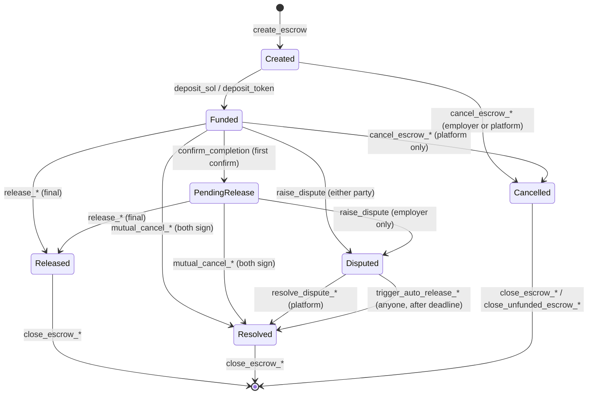
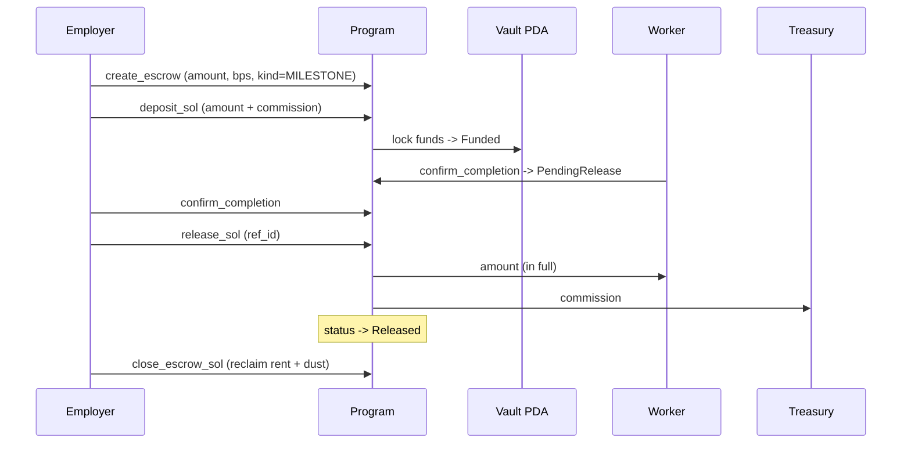
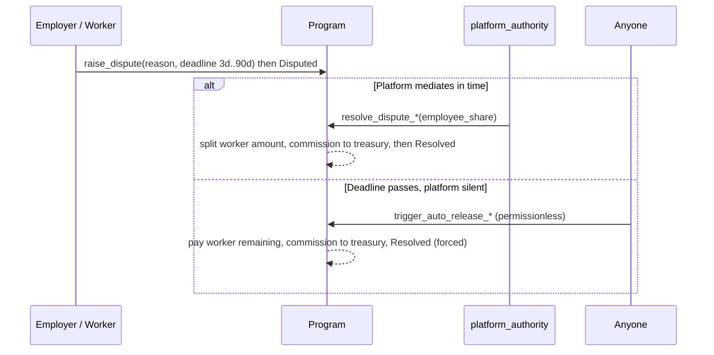
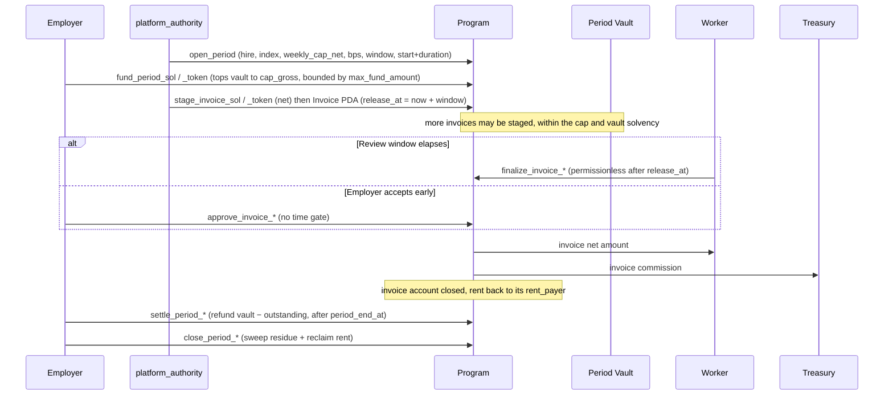

# Worqen Escrow

Trustless payment escrow and direct‑pay settlement for the [Worqen](https://worqen.com) job marketplace, written in Rust with the [Anchor](https://www.anchor-lang.com) framework on Solana. Employers lock funds in a program‑owned vault when they hire; workers are paid only after confirmation, with **platform‑mediated dispute resolution** and a permissionless **deadline safety net** so funds can never be stranded by an unresponsive platform. The program settles in native **SOL** and an **allowlisted set of SPL stablecoins** (USDC / USDT / EURC), charges a **fee‑on‑top commission** routed to a dedicated treasury, and also offers a non‑escrow **direct‑pay** path (single, batch, and tips) for trusted hires. For ongoing hourly work it adds the **hourly v2 engine**: the employer pre‑funds a money‑capped period vault (`HourlyPeriod`), the platform stages each approved block of hours as its own **`HourlyInvoice` PDA** with a review window, and every invoice pays out permissionlessly once its window elapses — or instantly when the employer (or the platform on their behalf) approves it — with the same platform‑mediated dispute and deadline safety net, applied per invoice.

[](https://www.anchor-lang.com)
[](https://solana.com)
[](./LICENSE)
[](#8-security-model)

---

## 1. Devnet deployment

| Field | Value |
|---|---|
| **Program ID** | `FinhtLJ4PVBwVi8tGwWoCzN3vDpcMofBZFXFzmntGxEh` |
| **Cluster** | `devnet` — `https://api.devnet.solana.com` |
| **Program version** | `v1.5.0` (47 instructions; hourly account schema version `2`, escrow schema version `1`) — deployed to devnet 2026-08-17 at slot 484755229, tx `64q6nFoc…`, on-chain bytes sha256 `73ea9104…` (751,720 B, SBPFv3), byte-identical to `target/deploy-v3/worqen_escrow.so`; see `devnet-deployment.json`. |
| **On‑chain IDL account** | `D5EDchbfDVyCfgF1SmVTXutyDAiSU4R5ZYWyH3urwXZC` (Program Metadata Program, canonical `idl` seed — Anchor 1.x. The legacy Anchor-0.32 account `2Y1y1m4c…` was closed on 2026-08-17 and its rent recovered. If `anchor idl fetch` returns a truncated stream, re-run `make idl-devnet`.) |
| **ProgramData account** | `5dGNYXHqDNk83Hch1MUPKGx3CviFcWX5cPKQFHFiZQcw` |
| **Upgrade authority** | `Gg5L88vFoL32Dw64qXX4SirD8SHPfCjJEqm3Qrjjh6zz` (devnet single key, `~/.config/solana/devnet-escrow.json`; mainnet must be a multisig) |
| **Config PDA** | `FmxSRZbdgqnA5ufZ3DP2t8swyMPn6pLboFa6JxHLC9aL` (seed `"config"`) |
| **Config authority** | `MPq6BwTsfBNmA7DwdaRGLeX8Bg67Kj5sFwsiYDexste` |
| **Treasury (`fee_recipient`)** | `49gGSC3hGZ2KFX4rFou9PJqjMchKQGNBpFQzpYhaNan1` (dedicated devnet treasury; mainnet must be a cold/multisig wallet) |
| **`Config.platform_authority`** | `64PF1jbXinCFteyegYpkPJ25fHKibPeVGJsjmc4AH46H` (the backend ops key; must be set before any `open_period` can succeed) |
| **Explorer** | <https://explorer.solana.com/address/FinhtLJ4PVBwVi8tGwWoCzN3vDpcMofBZFXFzmntGxEh?cluster=devnet> |
| **Solscan** | <https://solscan.io/account/FinhtLJ4PVBwVi8tGwWoCzN3vDpcMofBZFXFzmntGxEh?cluster=devnet> |

**The program id is cfg‑split** (`programs/worqen-escrow/src/lib.rs:29-32`): a `--features mainnet` build (used only by `release.yml`'s verifiable build) declares `HShWcYbT6wGrndgauQxNrcNJuJQ1BX9CVZqFSn9Q7rNs`; **every other build — devnet, localnet, LiteSVM tests, CI — is `Finht…`**. `Anchor.toml` matches per cluster.

> The original v1 program `6FtagT9Xm9b6eBHgDmxggam2KuiQbPYywUXnrs7B2gEJ` is **dead**: its upgrade‑authority keypair was lost, which is why v1.2.0 moved to a fresh id, and it has no hourly‑v2 instructions. Never point an environment at it. Off‑chain defaults that still name it (`backend/app/core/config.py`, the frontend `escrow-program.ts` fallback) must be overridden with `ESCROW_PROGRAM_ID` / `NEXT_PUBLIC_ESCROW_PROGRAM_ID`.

> The canonical deployment manifest is [`devnet-deployment.json`](./devnet-deployment.json) — it is the source of truth for the program ID, PDAs, mints, and CI/deploy scripts.

---

## 2. Core concepts

### Two settlement engines

The program ships **two independent settlement engines** that share one Config, treasury, commission model, and pause switch:

1. **`Escrow`** — the per‑milestone / fixed‑price vault documented throughout this section (create → fund → confirm → release, plus disputes, direct‑pay, and batch pay). Its `escrow_kind` tag can also mark a lightweight `HOURLY`/`RETAINER` top‑up + draw‑down flow (see flow (c)).
2. **`HourlyPeriod` + `HourlyInvoice`** — the **hourly v2** engine for ongoing hourly work: a money‑capped, pre‑funded period vault whose approved blocks of hours are staged as **individual `HourlyInvoice` PDAs**, each settled permissionlessly after its review window (see flow (j), the hourly schemas, and the hourly instruction table).

Both engines use the same four roles (**employer / employee / platform_authority / treasury**) and the same fee‑on‑top commission, but different account types and PDAs. **Both handle native SOL and allowlisted SPL tokens** — every money‑moving hourly instruction ships as a `_sol` / `_token` pair. The sections below describe the `Escrow` engine unless they say otherwise.

### The three‑party model + the treasury

Every escrow names three roles plus a separate fee destination:

| Role | What it is | Can it sign? | Does it hold money? |
|---|---|---|---|
| **employer** | The payer. Creates, funds, confirms, and (in `Created`) cancels the escrow. | Yes | No (funds live in the vault PDA) |
| **employee** | The worker. Receives the worker `amount` in full. | Yes (confirm, self‑release after both confirm) | Receives payouts |
| **platform_authority** | Per‑escrow **hot ops key** (the Worqen backend). Resolves disputes, cancels funded escrows, force/auto‑releases, rotates keys. | Yes | **No — it never receives commission** |
| **fee_recipient** | The **treasury** (`Config.fee_recipient`, snapshotted onto each escrow at create). Receives all commission. | **Never signs** | Receives commission only |

The strict separation between the **ops key** (`platform_authority`, hot, signs) and the **treasury** (`fee_recipient`, cold, never signs) means a compromise of the operations key cannot redirect funds to itself.

### The global Config PDA

A singleton account at PDA `[b"config"]` holds platform‑wide state:

- **Mint allowlist** — up to 30 SPL mints permitted for escrow and direct‑pay. Native SOL is always allowed and is not stored.
- **Pause kill‑switch** — when `paused = true`, the program rejects the **15 money‑in instructions**: `create_escrow`, `deposit_sol/_token`, `pay_with_commission_sol/_token`, `batch_pay_with_commission_sol/_token`, `open_period`, `fund_period_sol/_token`, `raise_weekly_cap`, `stage_invoice_sol/_token`, and `approve_invoice_sol/_token`. It can **never** block release, confirm, dispute, resolve, auto‑release, finalize, settle, or close — so a pause can never strand user funds. Since v1.4.0 the deposit path is inside the gate, so a pause stops every new inflow, including into an escrow that was already created.
- **Canonical platform authority** (`platform_authority`) — the ops key every `Escrow` and `HourlyPeriod` is pinned to at `create_escrow` / `open_period`, so no caller can name a hostile arbitrator. `open_period` additionally requires it as a co‑signer, which is what stops a griefer from squatting a period PDA. `Pubkey::default()` until an admin sets it, and while it is unset nothing can be created or opened.
- **Default commission** (`default_commission_bps`) and the **treasury** (`fee_recipient`).
- **Two‑step admin handoff** — `update_config(new_pending_authority)` then `accept_authority` (signed by the pending key). Prevents handing the keys to a typo'd address.

### Fee‑on‑top commission model

Commission is **on top of** the worker's pay, never deducted from it. The worker always receives the full `amount`.

```
employer deposits  =  amount  +  commission
worker receives    =  amount                  (in full)
treasury receives  =  commission              ( = amount * bps / 10000, floored )
```

| Tier | bps | Rate | Notes |
|---|---|---|---|
| Standard | `500` | 5% | `Escrow::DEFAULT_COMMISSION_RATE_BPS` |
| Prime (subscriber) | `150` | 1.5% | `Escrow::PRIME_COMMISSION_RATE_BPS` — backend passes the effective bps per call |
| Tip | `200` | 2% | `Escrow::TIP_COMMISSION_RATE_BPS` |
| **Hard cap** | `1000` | **10%** | `Escrow::MAX_COMMISSION_RATE_BPS` — enforced on‑chain; any higher rate is rejected |

The tier constants are informational; the **effective `bps` is supplied per instruction by the backend** and only the 10% cap is enforced on chain. Freelancers pay nothing — the employer pays the fee.

> `PRIME_COMMISSION_RATE_BPS = 150` no longer matches the product: Prime was repriced to **300 bps** in the backend's subscription‑plan table (`reprice_prime_plan` migration), and the backend passes the plan's rate. The constant is unused by any handler, so the mismatch is cosmetic — but never treat it as the live Prime rate.

### Per‑milestone escrow + grouping

Escrows are **per‑milestone**, not per‑hire. A multi‑milestone hire creates one escrow per milestone, linked off‑chain by `escrow_group_id` (an off‑chain SHA‑256 of the hire id), with `sequence_in_group` / `total_in_group` so an indexer can collect all milestones of a hire without an off‑chain join. Ungrouped escrows set the group id to zero bytes and the sequence/total to 0.

An `escrow_kind` tag (`u8`, not a closed enum so new kinds can be added without a schema migration) classifies the product flow: `MILESTONE = 0`, `HOURLY = 1`, `RETAINER = 2`, `OTHER = 255`. This tag lives on the `Escrow` account; the dedicated weekly `HourlyPeriod` engine (flow (j)) is a separate account type, not an `escrow_kind`.

### PDAs

| PDA | Seeds | Holds |
|---|---|---|
| **Config** | `[b"config"]` | The singleton global config |
| **Escrow** | `[b"escrow", escrow_id]` | The escrow state account (`escrow_id` = random 32 bytes from the backend) |
| **Escrow vault** | `[b"vault", escrow_account_key]` | The locked funds — native SOL in a 0‑data PDA, or an SPL ATA owned by the escrow PDA |
| **HourlyPeriod** | `[b"hourly", hire_id, period_index (u32 LE)]` | The period state account (`hire_id` = SHA‑256 of the off‑chain hire id) |
| **Period vault** | `[b"vault", period_account_key]` | The period's pre‑funded balance — native SOL in a 0‑data PDA, or an SPL ATA owned by the **period** PDA |
| **HourlyInvoice** | `[b"hourly_inv", period_account_key, invoice_index (u16 LE)]` | One staged block of hours; closed on payout, rent back to its `rent_payer` |

> **Bump gotcha:** SOL CPIs from an escrow vault sign with `vault_bump`; SPL token CPIs sign with `escrow.bump` (the escrow PDA is the ATA authority). Mixing them surfaces as "unauthorized signer". The hourly engine differs — the **period PDA** is the authority for both its token ATA and (via `vault_bump`) its native vault.

### Escrow lifecycle / state machine


```mermaid
stateDiagram-v2
    [*] --> Created: create_escrow
    Created --> Funded: deposit_sol / deposit_token
    Created --> Cancelled: cancel_escrow_* (employer or platform)
    Funded --> PendingRelease: confirm_completion (first confirm)
    Funded --> Released: release_* (final)
    Funded --> Disputed: raise_dispute (either party)
    Funded --> Resolved: mutual_cancel_* (both sign)
    Funded --> Cancelled: cancel_escrow_* (platform only)
    PendingRelease --> Released: release_* (final)
    PendingRelease --> Disputed: raise_dispute (employer only)
    PendingRelease --> Resolved: mutual_cancel_* (both sign)
    Disputed --> Resolved: resolve_dispute_* (platform)
    Disputed --> Resolved: trigger_auto_release_* (anyone, after deadline)
    Released --> [*]: close_escrow_*
    Resolved --> [*]: close_escrow_*
    Cancelled --> [*]: close_escrow_* / close_unfunded_escrow_*
```

`Released`, `Resolved`, and `Cancelled` are terminal. Rent is reclaimed by closing a terminal escrow.

---

## 3. Flows

### (a) Fixed‑price escrow — happy path


```mermaid
sequenceDiagram
    participant E as Employer
    participant P as Program
    participant V as Vault PDA
    participant W as Worker
    participant T as Treasury
    E->>P: create_escrow (amount, bps, kind=MILESTONE)
    E->>P: deposit_sol  (amount + commission)
    P->>V: lock funds  -> Funded
    W->>P: confirm_completion  -> PendingRelease
    E->>P: confirm_completion
    E->>P: release_sol (ref_id)
    P->>W: amount (in full)
    P->>T: commission
    Note over P: status -> Released
    E->>P: close_escrow_sol  (reclaim rent + dust)
```

`release_*` is authorized for: the **employer** (after `employer_confirmed`), the **platform_authority**, or the **worker** once *both* parties have confirmed (covers the "employer confirmed then went silent" case without a dispute).

### (b) Multi‑milestone

The backend creates N escrows sharing one `escrow_group_id`, each with `sequence_in_group ∈ [1, total_in_group]`. Each milestone funds, confirms, and releases independently following flow (a). Indexers reassemble the hire from the group id.

### (c) Escrowed hourly / retainer

For ongoing work, create with `escrow_kind = HOURLY` or `RETAINER` and fund a block per approved chunk of time. The `escrow_kind` tag is a classification for indexers only: a fixed-price escrow funds once and releases once whatever its kind. v1.4.0 removed the `deposit_more_*` top‑up and `release_partial_*` draw‑down instructions — ongoing hourly work belongs in the hourly v2 engine (flow (j)), which is what the backend actually calls.

### (d) Direct pay (non‑escrow, fee‑on‑top)

For trusted hires and approved‑invoice settlement, `pay_with_commission_sol` / `pay_with_commission_token` atomically pays the worker the full `amount` and a commission on top to the treasury in one transaction — **no escrow, no lock, no state persisted**. Indexers rely on the `DirectPaymentMade` event. Subject to the pause switch and (for tokens) the mint allowlist.

### (e) Batch payout to many recipients

`batch_pay_with_commission_sol` / `batch_pay_with_commission_token` fan out a single fee‑on‑top direct payment to **up to 16 recipients** in one atomic transaction (team payouts, referral fees). Recipient accounts/ATAs are passed via `remaining_accounts`, positionally aligned with the `amounts` vector; one commission on the total goes to the treasury. No recipient may equal the payer.

### (f) Dispute → resolve, and the auto‑release safety net


```mermaid
sequenceDiagram
    participant Party as Employer / Worker
    participant P as Program
    participant Plat as platform_authority
    participant Anyone as Anyone
    Party->>P: raise_dispute(reason, deadline 3d..90d) then Disputed
    alt Platform mediates in time
        Plat->>P: resolve_dispute_*(employee_share)
        P-->>P: split worker amount, commission to treasury, then Resolved
    else Deadline passes, platform silent
        Anyone->>P: trigger_auto_release_* (permissionless)
        P-->>P: pay worker remaining, commission to treasury, Resolved (forced)
    end
```

`dispute_deadline` is **mandatory** and bounded to `[now + 3 days, now + 90 days]`. The 3‑day minimum guarantees the platform always has time to mediate before anyone can force‑resolve (this closes a self‑dispute‑then‑instant‑payout hole). After the deadline, **anyone** can call `trigger_auto_release_*` to pay the worker, so an unresponsive platform can never strand a worker's funds. As of v1.1.0 the platform **retains** its commission on a resolved or force-resolved dispute (routed to the treasury, never to the ops key). In `Funded` either party may dispute; in `PendingRelease` only the employer may (the worker is already committed by the prior confirm).

### (g) Mutual cancel (amicable settle, both sign)

`mutual_cancel_sol` / `mutual_cancel_token` lets the **employer and employee both sign** to split a non‑terminal (`Funded` / `PendingRelease`) escrow without a dispute or platform involvement. `employee_share` (≤ remaining worker amount) goes to the worker; the remainder and any dust go to the employer, while the commission is retained by the treasury. Status → `Resolved`.

### (h) Cancel + close / close‑unfunded (rent recovery)

- **Cancel** (`cancel_escrow_*`): in `Created`, the employer or platform may cancel; once `Funded`, **only the platform** may cancel (the employer must dispute instead of unilaterally reclaiming funds the worker may have started against). The worker deposit refunds to the employer; any commission collected while funded is retained by the treasury.
- **Close** (`close_escrow_*`): on a terminal escrow, employer **or** platform sweeps any vault dust and refunds the escrow account's rent (~0.005 SOL) to the employer.
- **Close‑unfunded** (`close_unfunded_escrow_*`): reclaims rent on a `Cancelled` escrow that was **never funded** (`funded_at == 0`); for SOL no vault is involved, for tokens no vault ATA was ever created.

### (i) Tips

A tip is just a direct payment at the tip rate: `pay_with_commission_*` with `commission_bps = 200` (2%). No escrow account is involved.

### (j) Hourly v2 — per‑invoice period settlement (`HourlyPeriod` + `HourlyInvoice`)

For ongoing hourly engagements the **hourly v2** engine gives the worker a guaranteed per‑invoice settlement: the employer pre‑funds a money‑capped vault for the period, and each approved block of hours becomes its **own invoice account** with a review window, then pays out automatically. One period account exists per `(hire_id, period_index)` — a hire‑anchored window the backend computes (normally a week) and the program enforces as `[period_start_at, period_end_at)`. It supports **native SOL and allowlisted SPL mints**, and holds **unlimited invoices** (bounded only by the cap and a `u16` index), each in its own PDA.


```mermaid
sequenceDiagram
    participant E as Employer
    participant Plat as platform_authority
    participant P as Program
    participant V as Period Vault
    participant W as Worker
    participant T as Treasury
    Plat->>P: open_period (hire, index, weekly_cap_net, bps, window, start+duration)
    E->>P: fund_period_sol / _token (tops vault to cap_gross, bounded by max_fund_amount)
    Plat->>P: stage_invoice_sol / _token (net) then Invoice PDA (release_at = now + window)
    Note over P,V: more invoices may be staged, within the cap and vault solvency
    alt Review window elapses
        W->>P: finalize_invoice_* (permissionless after release_at)
    else Employer accepts early
        E->>P: approve_invoice_* (no time gate)
    end
    P->>W: invoice net amount
    P->>T: invoice commission
    Note over P: invoice account closed, rent back to its rent_payer
    E->>P: settle_period_* (refund vault − outstanding, after period_end_at)
    E->>P: close_period_* (sweep residue + reclaim rent)
```

**Cap and funding.** `weekly_cap_net` is the most *net* pay the worker can earn in the period; the vault is funded to `cap_gross = weekly_cap_net + commission(weekly_cap_net)`. `fund_period_sol` / `_token` (employer signs) transfers exactly `cap_gross − funded_gross` and rejects anything above the caller‑supplied `max_fund_amount` (`FundExceedsMax`), which is what stops a `raise_weekly_cap` front‑run from draining more than the employer agreed to. The SOL variant additionally seeds a one‑time `vault_rent_reserve` so per‑invoice payouts can never leave the vault below rent‑exempt. `raise_weekly_cap` (employer or platform) can only **increase** the cap, never below the already‑staged total, and moves no money — fund the delta afterwards. There is **no delegate/pull funding**: the `pull_fund_period` instruction and the `[b"delegate_auth"]` PDA of hourly v1 no longer exist.

**Invoices.** `stage_invoice_sol` / `_token` (the period's `platform_authority` signs and pays the invoice rent) creates an invoice PDA at the current `invoice_count`: it books the marginal commission, sets `release_at = now + review_window_secs` (default **7 days**, max 30), and requires the vault to already cover every live invoice plus this one *and* the SOL rent reserve (`VaultUnderfunded` otherwise). Staging is only allowed inside the period window, and the first stage flips the period `Funded → Active`.

**Settlement.** After `release_at`, **anyone** can call `finalize_invoice_sol` / `_token` to pay the worker that invoice's net amount and route its commission to the treasury — the permissionless guarantee that approved work is always paid, even if the platform goes quiet. Before that, `approve_invoice_sol` / `_token` (period **employer** or **platform**) performs the identical money motion with **no time gate**, so an employer who is happy with the work can release instantly instead of waiting out the window. Either way the invoice account is closed and its rent returns to the `rent_payer`.

**Disputes.** Before an invoice's window elapses, the employer, worker, or platform can `raise_invoice_dispute(deadline, reason)` (deadline bounded to `[now + 3 days, now + 90 days]`), moving that invoice to `Disputed`. The platform then calls `resolve_invoice_sol` / `_token(employee_share)`: the worker gets `employee_share`, the treasury keeps commission **proportional to that share** (capped at the invoice's booked commission), and the employer is refunded the remainder — the unpaid net **plus** the un‑earned commission. If the platform never acts, after the deadline **anyone** can call `auto_release_invoice_sol` / `_token` to pay the worker the full invoice (commission to treasury) — the same platform‑failure safety net as the milestone escrow, applied per invoice.

**Wind‑down.** After `period_end_at`, **anyone** may call `settle_period_sol` / `_token` to refund everything not earmarked by a live invoice (`vault − outstanding_total`, less the SOL rent reserve) to the employer; the period moves to `Settled`. Once it is settled and `live_invoices == 0`, **anyone** may `close_period_sol` / `_token` to sweep any residue to the employer, close the vault, and return the period's rent to its `rent_payer`. Disputed or still‑staged invoices keep their money until they finalize or resolve.

---

## 4. Instruction reference (47 total)

Counts: Config 5 · escrow lifecycle 5 · payout 2 · dispute 5 · cancel & close 5 · extended flows 2 · direct pay 4 · hourly v2 19.

> **Caller-supplied destination accounts (v1.5.0).** The ten `_token` instructions that pay out
> (`release_token`, `mutual_cancel_token`, `resolve_dispute_token`, `trigger_auto_release_token`,
> `finalize_invoice_token`, `auto_release_invoice_token`, `approve_invoice_token`,
> `resolve_invoice_token`, `settle_period_token`, `close_period_token`) no longer create their
> destination token accounts and no longer require the *canonical* ATA — they validate only
> `owner` + `mint`. **Every destination must already exist**, or the instruction fails
> `AccountNotInitialized` (3012); prepend an idempotent `CreateAssociatedTokenAccountIdempotent`.
> Only the three *vault* ATAs (`deposit_token`, `fund_period_token`, `settle_period_token`) still
> self-create.

### Config (5)

| Instruction | Who signs | Precondition | Effect |
|---|---|---|---|
| `init_config` | future admin | Config PDA not yet initialized; `fee_recipient != default`; `bps <= 1000`; <= 30 mints | Creates singleton Config; signer becomes `authority`; `paused = false`, `platform_authority = default()` |
| `update_config` | `authority` | — | Sets any of fee_recipient / default bps / paused / pending_authority / platform_authority (each `None` left unchanged) |
| `accept_authority` | `pending_authority` | a pending handoff exists | Completes two‑step admin handoff |
| `add_allowed_mint` | `authority` | mint not present; list `< 30` | Adds an SPL mint to the allowlist |
| `remove_allowed_mint` | `authority` | mint present | Removes an SPL mint from the allowlist |

### Escrow lifecycle (5)

| Instruction | Who signs | Precondition | Effect |
|---|---|---|---|
| `create_escrow` | employer | not paused; mint allowed; `amount > 0`; `bps <= 1000`; `escrow_kind` known; parties distinct; native/mint consistent; valid group seq; `platform_authority == config.platform_authority != default` | Creates escrow PDA in `Created`; snapshots `fee_recipient`, `escrow_kind`, `terms_hash`. Since v1.4.0 the arbitrator is pinned to Config, exactly like `open_period` |
| `deposit_sol` | employer | **not paused** (carries the `Config` account since v1.4.0); `Created`; native | Transfers `amount + commission` to vault → `Funded` |
| `deposit_token` | employer | **not paused**; `Created`; SPL; mint matches | Transfers `amount + commission` to vault ATA (still `init_if_needed`) → `Funded` |
| `confirm_completion` | employer or employee | `Funded` or `PendingRelease`; not already confirmed | Marks confirm; first confirm advances `Funded → PendingRelease` |
| `update_platform_authority` | current `platform_authority` | not `Disputed`; new key != current, employer, or employee | Rotates the per‑escrow ops key |

### Payout (2)

| Instruction | Who signs | Precondition | Effect |
|---|---|---|---|
| `release_sol` | employer (confirmed) / platform / worker (both confirmed) | `Funded` or `PendingRelease`; native | Pays worker remaining `amount`, drains rest to treasury → `Released` |
| `release_token` | same as above | `Funded` or `PendingRelease`; SPL | Token variant of `release_sol` |

### Dispute (5)

| Instruction | Who signs | Precondition | Effect |
|---|---|---|---|
| `raise_dispute` | employer or employee (employer‑only in `PendingRelease`) | `Funded`/`PendingRelease`; deadline in `[now+3d, now+90d]`; reason <= 256 B | Freezes funds → `Disputed` |
| `resolve_dispute_sol` | `platform_authority` | `Disputed`; native; `employee_share <= remaining` | Splits remaining worker amount; commission retained by treasury → `Resolved` |
| `resolve_dispute_token` | `platform_authority` | `Disputed`; SPL | Token variant |
| `trigger_auto_release_sol` | **anyone** (pays gas) | `Disputed`; native; `now >= dispute_deadline` | Pays worker remaining; commission retained by treasury → `Resolved (forced)` |
| `trigger_auto_release_token` | **anyone** | `Disputed`; SPL; deadline reached | Token variant |

### Cancel & close (5)

| Instruction | Who signs | Precondition | Effect |
|---|---|---|---|
| `cancel_escrow_sol` | employer (in `Created`) or platform (in `Created`/`Funded`) | `Created` or `Funded`; native; reason <= 128 B | Refunds worker deposit to employer; commission retained by treasury if funded → `Cancelled` |
| `cancel_escrow_token` | same as above | `Created` or `Funded`; SPL | Token variant |
| `close_escrow_sol` | employer or platform | terminal status; native | Sweeps dust + refunds rent to employer; closes account |
| `close_escrow_token` | employer or platform | terminal status; SPL; vault empty | Sweeps residual tokens + refunds all rent; closes |
| `close_unfunded_escrow_token` | employer or platform | `Cancelled` and `funded_at == 0`; SPL | Reclaims rent (no vault ATA) |

### Extended flows (2)

| Instruction | Who signs | Precondition | Effect |
|---|---|---|---|
| `mutual_cancel_sol` | employer **and** employee | `Funded`/`PendingRelease`; native; `employee_share <= remaining` | Amicable split; commission retained by treasury → `Resolved` |
| `mutual_cancel_token` | employer **and** employee | `Funded`/`PendingRelease`; SPL | Token variant |

### Direct pay — no escrow (4)

| Instruction | Who signs | Precondition | Effect |
|---|---|---|---|
| `pay_with_commission_sol` | payer | not paused; `amount > 0`; `bps <= 1000`; no self‑pay | Pays worker `amount` + commission on top to treasury (atomic) |
| `pay_with_commission_token` | payer | not paused; mint allowed; SPL | Token variant |
| `batch_pay_with_commission_sol` | payer | not paused; 1–16 recipients; `len(amounts)==recipients`; no self‑pay | Fans out to many recipients; one commission on total to treasury |
| `batch_pay_with_commission_token` | payer | not paused; mint allowed; 1–16 ATAs | Token variant |

### Hourly v2 — `HourlyPeriod` + `HourlyInvoice` (19, SOL + SPL)

Every money‑moving instruction is a `_sol` / `_token` pair; `open_period`, `raise_weekly_cap` and `raise_invoice_dispute` are single instructions because they move no funds.

| Instruction | Who signs | Precondition | Effect |
|---|---|---|---|
| `open_period` | employer **or** `Config.platform_authority` as `authorizer` (pays rent, stored as `rent_payer`) **plus** `Config.platform_authority` as the `platform_signer` co‑signature | not paused; `platform_authority == config.platform_authority != default`; `fee_recipient == config.fee_recipient`; mint allowed / native‑consistent; `weekly_cap_net > 0`; `bps <= 1000`; parties distinct; `review_window ∈ (0, 30d]`; `duration ∈ [1d, 30d]`; `end > now`; `start <= now + 30d` | Creates the `HourlyPeriod` PDA → `Open` |
| `fund_period_sol` / `_token` | employer | not paused; `Open`/`Funded`/`Active`; `now < period_end_at`; transfer amount `<= max_fund_amount` | Moves exactly `cap_gross − funded_gross` into the vault (SOL variant also seeds `vault_rent_reserve`); first fund → `Funded` |
| `raise_weekly_cap` | employer or period platform | not paused; `Open`/`Funded`/`Active`; `now < end`; `new >= cap` and `>= total_staged_net` | Raises `weekly_cap_net` (can never lower it); moves no money |
| `stage_invoice_sol` / `_token` | period `platform_authority` (pays the invoice rent) | not paused; `Funded`/`Active`; `start <= now < end`; `total_staged + net <= cap`; vault covers outstanding + this invoice + commission (+ SOL rent reserve) | Creates the invoice PDA at `invoice_count` with `release_at = now + window` → `Staged`; first stage → period `Active` |
| `raise_invoice_dispute` | employer, employee, or platform | invoice `Staged`; `now < release_at`; deadline in `[now+3d, now+90d]`; reason <= 256 B (event only, not stored) | Invoice → `Disputed` |
| `finalize_invoice_sol` / `_token` | **anyone** | invoice `Staged`; `now >= release_at` | Pays worker the net + commission to treasury; closes the invoice (rent → `rent_payer`) |
| `approve_invoice_sol` / `_token` | period `employer` **or** period `platform_authority` | not paused; invoice `Staged`; **no time gate** | Same money motion as finalize, skipping the remaining review window; emits `HourlyInvoiceApproved` |
| `resolve_invoice_sol` / `_token` | period `platform_authority` | invoice `Disputed`; `employee_share <= amount_net` | Worker gets the share; treasury keeps `min(commission(share), invoice.commission)`; employer refunded the unpaid net + un‑earned commission; closes the invoice |
| `auto_release_invoice_sol` / `_token` | **anyone** | invoice `Disputed`; `now >= dispute_deadline != 0` | Pays worker the full net (commission to treasury); closes the invoice |
| `settle_period_sol` / `_token` | **anyone** | `now >= period_end_at`; status != `Settled` | Refunds `vault − outstanding_total` (SOL: less `vault_rent_reserve`) to the employer → `Settled` |
| `close_period_sol` / `_token` | **anyone** | `Settled`; `live_invoices == 0` | Sweeps vault residue to the employer (token: transfer + `CloseAccount`), closes the period, rent → `rent_payer` |

---

## 5. Account schemas

### `Config` (PDA `[b"config"]`)

| Field | Type | Meaning |
|---|---|---|
| `version` | `u8` | Config schema version (`1`) |
| `authority` | `Pubkey` | Admin (multisig on mainnet) — pause, allowlist, default fee, treasury |
| `pending_authority` | `Pubkey` | Pending admin during a two‑step handoff (`default` = none) |
| `fee_recipient` | `Pubkey` | Treasury that receives commission; snapshotted onto each escrow |
| `default_commission_bps` | `u16` | Informational default rate (`500`) |
| `paused` | `bool` | Kill‑switch — blocks new money only |
| `allowed_mints` | `Vec<Pubkey>` | Up to 30 permitted SPL mints (SOL always allowed, not listed) |
| `bump` | `u8` | Config PDA bump |
| `platform_authority` | `Pubkey` | Canonical ops key pinned onto every `HourlyPeriod` at open. Carved out of `reserved`, so Config accounts created before it existed read `Pubkey::default()` — and no period can open until an admin sets it |
| `reserved` | `[u8; 32]` | Forward‑compat padding |

### `Escrow` (PDA `[b"escrow", escrow_id]`)

| Field | Type | Meaning |
|---|---|---|
| `version` | `u8` | Account schema version (`ESCROW_ACCOUNT_VERSION = 1`) |
| `escrow_id` | `[u8; 32]` | Random unique id from backend; PDA seed |
| `escrow_group_id` | `[u8; 32]` | Links milestones of one hire (zero = ungrouped) |
| `sequence_in_group` | `u8` | 1‑indexed position in group (0 if ungrouped) |
| `total_in_group` | `u8` | Total milestones in group (0 if ungrouped) |
| `employer` | `Pubkey` | Payer wallet |
| `employee` | `Pubkey` | Worker wallet |
| `platform_authority` | `Pubkey` | Per‑escrow ops/signing key (does **not** receive commission) |
| `amount` | `u64` | Worker payment in full (fee is on top) |
| `commission_amount` | `u64` | `amount * bps / 10000` |
| `commission_rate_bps` | `u16` | Commission rate in basis points |
| `released_to_employee` | `u64` | Cumulative amount paid via partials |
| `token_mint` | `Pubkey` | SPL mint, or System Program ID for SOL |
| `is_native` | `bool` | `true` = SOL, `false` = SPL |
| `status` | `EscrowStatus` | `Created`/`Funded`/`PendingRelease`/`Released`/`Disputed`/`Resolved`/`Cancelled` |
| `employer_confirmed` | `bool` | Employer confirmed completion |
| `employee_confirmed` | `bool` | Employee confirmed completion |
| `created_at` / `funded_at` / `completed_at` | `i64` | Lifecycle timestamps |
| `auto_release_at` | `i64` | Reserved future auto‑release deadline (validated at create; not read in v1) |
| `release_initiator` | `Pubkey` | Who triggered the release |
| `dispute_reason` | `[u8; 256]` | UTF‑8 dispute reason |
| `dispute_raised_by` / `dispute_raised_at` | `Pubkey` / `i64` | Who/when a dispute was raised |
| `dispute_deadline` | `i64` | After this, anyone may force‑resolve |
| `dispute_resolved_by` / `dispute_resolved_at` | `Pubkey` / `i64` | Who/when resolved |
| `employee_share_resolved` / `employer_share_resolved` | `u64` | Split amounts on resolution |
| `cancellation_reason` | `[u8; 128]` | UTF‑8 cancel reason |
| `cancelled_by` | `Pubkey` | Who cancelled |
| `bump` | `u8` | Escrow PDA bump (token CPI authority) |
| `vault_bump` | `u8` | Vault PDA bump (SOL CPI authority) |
| `escrow_kind` | `u8` | Product‑flow tag (`MILESTONE`/`HOURLY`/`RETAINER`/`OTHER`) |
| `fee_recipient` | `Pubkey` | Treasury snapshot at create |
| `terms_hash` | `[u8; 32]` | Optional tamper‑evident hash of agreed terms/invoice (zero = none) |
| `reserved` | `[u8; 64]` | Forward‑compat padding |

### `HourlyPeriod` (PDA `[b"hourly", hire_id, period_index]`)

The hourly v2 period account. Handles **native SOL and allowlisted SPL mints**. Live invoices are separate PDAs, not an inline array.

| Field | Type | Meaning |
|---|---|---|
| `version` | `u8` | Schema version (`HOURLY_PERIOD_VERSION = 2`) |
| `hire_id` | `[u8; 32]` | Off‑chain hire id (SHA‑256 of the hire UUID); PDA seed |
| `period_index` | `u32` | Hire‑anchored period number; PDA seed |
| `employer` / `employee` | `Pubkey` | Payer / worker wallets |
| `platform_authority` | `Pubkey` | Ops key (stages/approves/resolves; never holds fees), pinned to `Config.platform_authority` at open |
| `fee_recipient` | `Pubkey` | Treasury, snapshotted from Config |
| `token_mint` | `Pubkey` | SPL mint, or System Program ID when native |
| `is_native` | `bool` | `true` = SOL, `false` = SPL |
| `bump` / `vault_bump` | `u8` | Period PDA bump / native vault PDA bump (0 for token periods) |
| `rent_payer` | `Pubkey` | Whoever paid for the period account; receives its rent at close |
| `weekly_cap_net` | `u64` | Max net worker pay for the period (monotonic via `raise_weekly_cap`) |
| `commission_rate_bps` | `u16` | Commission rate (≤ 10%), snapshotted at open |
| `funded_gross` | `u64` | Cumulative gross funded into the vault |
| `total_staged_net` | `u64` | Lifetime net staged across all invoices (≤ `weekly_cap_net`) |
| `released_net` | `u64` | Cumulative net paid to the worker |
| `refunded_amount` | `u64` | Amount refunded to the employer at settle |
| `outstanding_net` / `outstanding_commission` | `u64` | Running sums over live (`Staged`/`Disputed`) invoices — the vault's earmarked liabilities |
| `vault_rent_reserve` | `u64` | Native‑SOL only: lamports parked so payouts never leave the vault below rent‑exempt |
| `invoice_count` | `u16` | Append‑only index cursor (next invoice's PDA seed) |
| `live_invoices` | `u16` | Open invoice accounts; `close_period_*` requires 0 |
| `review_window_secs` | `i64` | Per‑invoice review window (default 7d, max 30d) |
| `period_start_at` / `period_end_at` | `i64` | The staging window; `end = start + duration`, `duration ∈ [1d, 30d]` |
| `created_at` / `funded_at` / `settled_at` | `i64` | Lifecycle timestamps |
| `status` | `HourlyStatus` | `Open` → `Funded` → `Active` → `Settled` (the account is then deleted by `close_period_*`; there is no on‑chain `Closed`) |
| `reserved` | `[u8; 64]` | Forward‑compat padding |

### `HourlyInvoice` (PDA `[b"hourly_inv", period_key, invoice_index]`)

One staged block of hours. Created by `stage_invoice_*` and **closed** by finalize / approve / resolve / auto‑release — there is no terminal invoice status, so settled history lives in events and the backend.

| Field | Type | Meaning |
|---|---|---|
| `version` | `u8` | Schema version (`HOURLY_INVOICE_VERSION = 1`) |
| `period` | `Pubkey` | Owning `HourlyPeriod` |
| `invoice_index` | `u16` | Index within the period; PDA seed |
| `ref_id` | `[u8; 32]` | Hash of the off‑chain invoice id |
| `amount_net` | `u64` | Worker net for this invoice |
| `commission` | `u64` | Marginal (cumulative‑rounded) commission booked at stage |
| `staged_at` / `release_at` | `i64` | Stage time / when permissionless finalize unlocks |
| `dispute_deadline` | `i64` | 0 = no dispute; after it, anyone may force‑release |
| `disputed_by` | `Pubkey` | Who raised the dispute |
| `status` | `InvoiceStatus` | `Staged` \| `Disputed` |
| `rent_payer` | `Pubkey` | The staging platform key; receives the invoice rent on close |
| `bump` | `u8` | Invoice PDA bump |
| `reserved` | `[u8; 32]` | Forward‑compat padding |

### Events (24)

`EscrowCreated`, `EscrowFunded`, `CompletionConfirmed`, `EscrowReleased` (carries `ref_id`, `is_partial`, `remaining_worker_amount`), `DisputeRaised`, `DisputeResolved` (carries `forced`), `EscrowCancelled`, `PlatformAuthorityRotated`, `DirectPaymentMade`, `ConfigUpdated`, `MintAllowlistChanged`, `EscrowToppedUp`, `BatchPaymentMade`, `EscrowSettled`. The hourly engine adds `HourlyPeriodOpened`, `HourlyPeriodFunded`, `HourlyCapRaised`, `HourlyInvoiceStaged`, `HourlyInvoiceFinalized` (window‑elapsed payout; carries `forced`, always `false` today), `HourlyInvoiceApproved` (instant payout — an indexer that watches only `HourlyInvoiceFinalized` will **miss approvals**), `HourlyInvoiceDisputeRaised`, `HourlyInvoiceResolved` (carries `forced` — `false` for a platform resolve, `true` for an auto‑release — plus the treasury/refund split), `HourlyPeriodSettled`, and `HourlyPeriodClosed`.

Direct‑pay and batch‑pay persist no state — indexers rely entirely on `DirectPaymentMade` / `BatchPaymentMade`.

---

## 6. Error codes

| Code | Name | Meaning |
|---|---|---|
| 6000 | `InvalidStatus` | Escrow status invalid for this operation |
| 6001 | `Unauthorized` | Signer not authorized for this action |
| 6002 | `NotNativeEscrow` | Operation requires a native SOL escrow |
| 6003 | `NotTokenEscrow` | Operation requires an SPL token escrow |
| 6004 | `AlreadyConfirmed` | Party already confirmed completion |
| 6005 | `ReleaseNotAuthorized` | Release requires employer confirmation or platform authority |
| 6006 | `InvalidAmount` | Invalid amount specified |
| 6007 | `DisputeReasonTooLong` | Dispute reason exceeds 256 bytes |
| 6008 | `InvalidTokenMint` | Token mint does not match the escrow |
| 6009 | `InsufficientFunds` | Insufficient funds in vault |
| 6010 | `InvalidEmployeeShare` | Employee share exceeds remaining worker amount |
| 6011 | `InvalidCommissionRate` | Commission rate exceeds the 10% cap |
| 6012 | `EmployeeIsEmployer` | Employee and employer must differ |
| 6013 | `PlatformAuthorityConflict` | Platform authority must differ from employer and employee |
| 6014 | `CancellationReasonTooLong` | Cancellation reason exceeds 128 bytes |
| 6015 | `Reserved6015` | Retired in v1.4.0 (was `AutoReleaseNotReached`); the code is never returned |
| 6016 | `AutoReleaseNotConfigured` | Auto‑release not configured for this escrow |
| 6017 | `DisputeDeadlineNotReached` | Dispute deadline not reached |
| 6018 | `Reserved6018` | Retired in v1.4.0 (was `PartialReleaseTooLarge`); the code is never returned |
| 6019 | `InvalidGroupSequence` | `sequence_in_group` out of `[1, total_in_group]` |
| 6020 | `InvalidNewPlatformAuthority` | New platform authority equals employer or employee |
| 6021 | `InvalidAutoReleaseTime` | `auto_release_at` must be in the future |
| 6022 | `InvalidDisputeDeadline` | `dispute_deadline` must be in the future |
| 6023 | `SelfPaymentNotAllowed` | Self‑payment is not allowed |
| 6024 | `DisputeLockedAfterConfirm` | Dispute locked once a party confirmed (worker can't dispute in `PendingRelease`) |
| 6025 | `DisputeDeadlineRequired` | `dispute_deadline` must be > 0 (zero would disable the safety net) |
| 6026 | `DisputeDeadlineTooLong` | Exceeds the 90‑day max window |
| 6027 | `EmployerCancelAfterFundedDisallowed` | Employer can't cancel a funded escrow; must dispute |
| 6028 | `AuthorityRotationDuringDispute` | Cannot rotate `platform_authority` while `Disputed` |
| 6029 | `EscrowNotTerminal` | Escrow is not terminal; cannot close |
| 6030 | `AutoReleaseTooFar` | `auto_release_at` exceeds the max window (1 year) |
| 6031 | `IsNativeMintMismatch` | `is_native` and `token_mint` inconsistent |
| 6032 | `Reserved6032` | Retired in v1.4.0 (was `PartialReleaseLeavesDust`); the code is never returned |
| 6033 | `Reserved6033` | Retired in v1.4.0 (was `VaultNotEmpty`); the code is never returned |
| 6034 | `DisputeWindowTooShort` | `dispute_deadline` sooner than the 3‑day minimum |
| 6035 | `MintNotAllowed` | Token mint not on the platform allowlist |
| 6036 | `ProgramPaused` | Program is paused — one of the 15 pause‑gated instructions was called |
| 6037 | `InvalidFeeRecipient` | `fee_recipient` account does not match the escrow/config |
| 6038 | `NoPendingAuthority` | No pending authority to accept |
| 6039 | `PendingAuthorityMismatch` | Signer is not the pending authority |
| 6040 | `EscrowWasFunded` | Escrow was funded; use `close_escrow_*` instead |
| 6041 | `MintAllowlistFull` | Allowlist full or mint already present |
| 6042 | `TooManyRecipients` | More than 16 recipients in a batch |
| 6043 | `RecipientCountMismatch` | Recipient count != `amounts` length |
| 6044 | `EmptyBatch` | Batch must have at least one recipient |
| 6045 | `Reserved6045` | Retired in v1.4.0 (was `TopUpNotFunded`); the code is never returned |
| 6046 | `WeeklyCapExceeded` | Staged amount would exceed the weekly cap |
| 6047 | `InvoiceNotStaged` | Invoice is not in `Staged` status |
| 6048 | `InvoiceNotDisputed` | Invoice is not in `Disputed` status |
| 6049 | `InvoiceWindowNotElapsed` | Invoice review window has not elapsed |
| 6050 | `DisputeWindowClosed` | Cannot dispute after the invoice `release_at` |
| 6051 | `VaultUnderfunded` | Vault balance insufficient to back this earmark |
| 6052 | `EmployeeShareExceedsInvoice` | `employee_share` exceeds the invoice amount |
| 6053 | `CapCannotDecrease` | Weekly cap can only be raised, never lowered |
| 6054 | `CapBelowStaged` | Weekly cap cannot drop below the already‑staged total |
| 6055 | `PeriodFullyFunded` | Period vault already funded to the current `cap_gross` |
| 6056 | `PeriodEnded` | Period window has already ended |
| 6057 | `PeriodNotStarted` | Period window has not started yet |
| 6058 | `PeriodNotEnded` | Period window has not ended yet |
| 6059 | `PeriodAlreadySettled` | Period is already settled |
| 6060 | `PeriodNotSettled` | Period must be settled before closing |
| 6061 | `LiveInvoicesOutstanding` | Period still has live invoices |
| 6062 | `InvalidPeriodWindow` | Invalid period start/duration window |
| 6063 | `InvoiceIndexOverflow` | Invoice index overflow |
| 6064 | `InvoicePeriodMismatch` | Invoice does not belong to this period |
| 6065 | `InvalidPlatformAuthority` | `platform_authority` is unset or does not match Config (`create_escrow`, `open_period`) |
| 6066 | `FundExceedsMax` | Funding amount exceeds the caller‑supplied `max_fund_amount` |
| 6067 | `InvalidEscrowKind` | `escrow_kind` is not one of `MILESTONE`/`HOURLY`/`RETAINER`/`OTHER` |

68 variants total (6000–6067) — `programs/worqen-escrow/src/errors.rs` is the source of truth. `Reserved60xx` slots are retired codes kept in place so no live code renumbers.

Two Anchor **runtime** codes matter as much as the custom ones here: **3012 `AccountNotInitialized`**, now the failure mode when a caller does not pre-create a payout destination token account (v1.5.0 — see §4), and **2040 `ConstraintDuplicateMutableAccount`**, new with Anchor 1.1.2, raised when the same mutable account is passed in two slots of one instruction (e.g. an employer who is also the fee recipient).

---

## 7. Money math

```rust
commission           = floor(amount * commission_rate_bps / 10000)   // u128 intermediate
total_deposit        = amount + commission                            // checked add
remaining_worker     = amount - released_to_employee                  // saturating
remaining_commission = commission_amount - floor(released_to_employee * bps / 10000)
```

All SOL payout/refund/dispute/settle paths on the `Escrow` engine **drain the vault to its actual balance**, not the recorded amounts. This sweeps any dust someone sent to the vault directly and guarantees the vault ends at exactly 0 — Solana rejects an account left below the rent‑exempt minimum but above zero, so draining to actual balance is what makes the program dust‑DoS safe.

The hourly SOL vault solves the same problem the other way round: it is seeded with a one‑time `vault_rent_reserve = Rent::minimum_balance(0)` on the first `fund_period_sol`, every per‑invoice payout is bounded so the balance never dips below it, and only `close_period_sol` drains the reserve back to the employer.

Hourly commission uses a **cumulative‑delta** rule (`HourlyPeriod::marginal_commission`): each invoice books `commission(total_staged + amount) − commission(total_staged)`, so the sum of per‑invoice commissions equals the single‑shot commission on the same total.

**The two engines differ on non‑happy‑path commission.** The `Escrow` engine keeps the full remaining commission on dispute‑resolve, auto‑release, cancel and mutual‑cancel (the v1.1.0 decision below). The hourly engine's `resolve_invoice_*` **pro‑rates**: the treasury keeps only `min(commission(employee_share), invoice.commission)` and the un‑earned remainder is refunded to the employer along with the unpaid net.

---

## 8. Security model

- **Role separation.** The treasury (`fee_recipient`) **never signs** — it is a cold, receive‑only key. The per‑escrow `platform_authority` is a **hot ops key that never holds fees**, decoupled from the treasury. The commission destination is snapshotted at create time, so a later Config change can never re‑route an in‑flight escrow.
- **Upgrade authority.** On devnet a single file key (acceptable for devnet); **on mainnet the upgrade authority and Config authority must be a Squads multisig / HSM** (transfer post‑deploy with `solana program set-upgrade-authority`). Config admin uses a **two‑step handoff** so the keys can never be sent to a wrong address.
- **Drain‑actual‑balance.** All SOL release/resolve/cancel/settle paths transfer the vault's *real* lamport balance, defeating dust‑deposit DoS that would otherwise strand a vault below the rent‑exempt minimum.
- **Mint allowlist.** Only SOL plus an admin‑curated set of SPL mints are accepted. **Accepted‑stablecoin freeze risk:** USDC/USDT/EURC carry an issuer freeze authority; a frozen vault ATA or recipient ATA could block a transfer. The allowlist limits exposure to vetted issuers, and the deadline safety net plus close paths bound the blast radius.
- **Minimum dispute window.** A mandatory 3‑day floor on `dispute_deadline` guarantees the platform always has time to mediate before anyone can permissionlessly force‑resolve — closing the self‑dispute‑then‑instant‑payout hole. What removes any incentive for the platform to stall is the permissionless auto‑release: after the deadline **anyone** can force‑resolve to the worker, so an unresponsive platform can never strand funds. (As of v1.1.0 the platform *retains* its commission — routed to the treasury — on a resolved or force‑resolved dispute, cancel, or mutual cancel; it is no longer refunded to the employer.)
- **Pause that can't strand funds.** The kill‑switch gates the 15 money‑in instructions that carry the `Config` account — new escrows, all direct/batch pay, and every hourly intake and release‑on‑request path (`stage_invoice_*`, `approve_invoice_*`). Releases, confirms, disputes, resolves, auto‑releases, `finalize_invoice_*`, settles, and closes are always available, so every party can still withdraw while paused. `approve_invoice_*` is deliberately inside the gate even though it pays out: it is the only payout callable at will with no time lock, and the same invoice still settles through the pause‑free `finalize_invoice_*` once `release_at` passes. Since v1.4.0 `deposit_sol` / `deposit_token` are inside the gate too, so a pause stops every inflow.
- **`security_txt`.** The program embeds a [`solana-security-txt`](https://github.com/neodyme-labs/solana-security-txt) block: contact `security@worqen.com`, policy and source on GitHub, **`auditors: "Pending external audit"`**.
- **Forward compatibility.** All four account types carry a `version` byte and a `reserved` tail (`Escrow` 64 B, `HourlyPeriod` 64 B, `HourlyInvoice` 32 B, `Config` 32 B) so additive fields can be carved in without a realloc — `Config.platform_authority` was added exactly this way. `escrow_kind` is a `u8` (not a closed enum) so new product flows need no schema migration. Off‑chain decoders that hardcode byte offsets (the backend does) must be re‑checked after **any** field insert or reorder.

> **Audit status:** *Pending external audit.* Do not deploy to mainnet with real funds until the audit is complete and the upgrade/config authorities are multisig.

For the full rationale behind every hardening decision, see [`SECURITY.md`](./SECURITY.md) and the security‑driven release notes in [`devnet-deployment.json`](./devnet-deployment.json).

---

## 9. Build, test, deploy

### Prerequisites

- Rust (stable toolchain)
- Solana CLI **4.0+** — required, not just recommended: SBPFv3 artifacts are rejected by every 3.x client (deploy artifact built with platform‑tools 1.55)
- Anchor 1.1.2 (`avm use 1.1.2`)
- [Bun](https://bun.sh) (package manager + test runner)

### Build & test

```bash
bun install           # install TS deps
anchor build          # compiles the program + generates the IDL/types
bun test              # runs the full suite in-process via LiteSVM (no validator)
make build-deploy     # the SBPFv3 .so that deploys ship (see below)
make sizes            # both artifacts vs the mainnet ProgramData allocation
```

**The tested artifact is not the deployed artifact.** `anchor build` emits the default‑arch
`target/deploy/worqen_escrow.so` (905,720 B) that LiteSVM loads and that the IDL is derived from;
`make build-deploy` emits `target/deploy-v3/worqen_escrow.so` (751,720 B) via `cargo build-sbf
--arch v3 --tools-version v1.55`, and that is what every cluster deploy uploads. The Anchor CLI
pins its own platform‑tools and cannot be handed the arch flags, and **LiteSVM 1.1.0 cannot load an
SBPFv3 program at all** — hence the split. SBPFv3 requires **Agave ≥ 4.0.0** on the client and a
cluster with **SIMD‑0377** activated; a 3.x client rejects the file outright. Point the suite at a
different artifact with `WORQEN_SO_PATH=<path> bun test`.

Tests run **in-process with [LiteSVM](https://www.anchor-lang.com/docs/testing/litesvm)** — fast, deterministic, no local validator or devnet needed. Because LiteSVM can warp the on‑chain clock, the suite also covers **time‑locked paths** (e.g. `trigger_auto_release_*` after the dispute deadline) that a live validator can't easily test. All 47 instructions are exercised across `tests/escrow.test.ts` (46 tests — config, fixed‑price SOL + token, direct pay, disputes, rotation, the authorization negatives, and the v1.5.0 missing‑destination‑ATA negatives) and `tests/hourly.test.ts` (57 tests — hourly v2 in both SPL and native SOL, the full approve matrix, pause invariants, rent‑exemption, cross‑period isolation): **103 in total**. The suite loads the *default‑arch* artifact, so it proves the same source as the deploy, not the same bytes. (`anchor test` simply invokes `bun test`.)

### Deploy to devnet

```bash
make deploy-devnet   # make build-deploy + anchor upgrade with the SBPFv3 artifact
make idl-devnet      # republish the on-chain IDL
```

Or in place of `make deploy-devnet`, when you need `solana program deploy` directly — note the program keypair lives outside the repo, and that the uploaded file is the **v3** one:

```bash
make build-deploy
solana program deploy \
  --program-id ~/.config/solana/worqen-escrow-v2-program.json \
  --upgrade-authority ~/.config/solana/devnet-escrow.json \
  --url devnet \
  target/deploy-v3/worqen_escrow.so
```

After any program change, regenerate the frontend client: `bun run generate:client` (writes the codama `@solana/kit` client into `frontend/apps/dashboard/lib/solana-wallet/generated/`).

### Initialize on a fresh cluster

`make bootstrap-config` does steps 1–2 idempotently (`scripts/bootstrap-config.ts`); `scripts/set-platform-authority.ts` does step 3. The equivalent calls:

```ts
// 1. Create the global Config (signer becomes admin authority)
await program.methods
  .initConfig(feeRecipient, 500 /* default bps */, [] /* allowed mints */)
  .accounts({ authority: admin.publicKey })
  .rpc()

// 2. Allowlist the stablecoin mints (run once per mint)
await program.methods.addAllowedMint(USDC_MINT).accounts({ authority: admin.publicKey }).rpc()
await program.methods.addAllowedMint(USDT_MINT).accounts({ authority: admin.publicKey }).rpc()
await program.methods.addAllowedMint(EURC_MINT).accounts({ authority: admin.publicKey }).rpc()

// 3. Pin the canonical platform ops key — REQUIRED before any open_period succeeds
await program.methods
  .updateConfig(null, null, null, null, PLATFORM_AUTHORITY)
  .accounts({ authority: admin.publicKey })
  .rpc()
```

**Reference mints** (from `devnet-deployment.json`):

| Token | Mainnet | Devnet |
|---|---|---|
| USDC | `EPjFWdd5AufqSSqeM2qN1xzybapC8G4wEGGkZwyTDt1v` | `4zMMC9srt5Ri5X14GAgXhaHii3GnPAEERYPJgZJDncDU` |
| USDT | `Es9vMFrzaCERmJfrF4H2FYD4KCoNkY11McCe8BenwNYB` | (no devnet mint — alias to USDC) |
| EURC | `HzwqbKZw8HxMN6bF2yFZNrht3c2iXXzpKcFu7uBEDKtr` | `HzwqbKZw8HxMN6bF2yFZNrht3c2iXXzpKcFu7uBEDKtr` |

### Verified build (mainnet path)

For mainnet, ship a **verifiable build** so anyone can confirm the on‑chain bytecode matches this source:

```bash
solana-verify build                                   # reproducible (Docker) build
solana-verify verify-from-repo --remote -um \
  --program-id <program-id> <github-repo-url>         # writes the on-chain verification
```

Or run `make verify-devnet` / `scripts/verify.sh`.

Use a fresh secure program keypair, update `declare_id!` + `Anchor.toml`, and deploy with a Squads multisig as both upgrade and config authority.

### Continuous integration & deployment

Three GitHub Actions workflows in `.github/workflows/`:

| Workflow | Trigger | What it does |
|---|---|---|
| **`ci.yml`** | every push / PR to `master` | `cargo fmt --check`, `clippy -D warnings`, `anchor build`, the **full per‑instruction LiteSVM suite via `bun test`** (in‑process, no validator), plus a build of the SBPFv3 deployable with an assertion that its relocation sections are gone. The merge gate. |
| **`deploy.yml`** | manual (`workflow_dispatch`) | Builds both artifacts, **upgrades the devnet program in place with the SBPFv3 one**, refreshes the on‑chain IDL, and re‑runs the LiteSVM suite on the default‑arch build. Gated by the `devnet` environment. |
| **`release.yml`** | tag `v*` | **Reproducible `solana-verify` build** (default arch) *and* the SBPFv3 deployable, publishes both `.so`s + IDL + both hashes as a **GitHub Release**, and (behind the protected `mainnet-beta` environment) writes the **v3 buffer for the Squads multisig** to execute the mainnet upgrade. |

> `solana-verify` has no `--arch` knob, so `program-hash.txt` (reproducible, default arch) and `program-hash-v3.txt` (the bytes actually deployed) differ by construction. On‑chain source verification of the shipped v3 bytes is an open gap.

Required secrets (set per **Environment** in repo settings):

| Secret | Environment | Purpose |
|---|---|---|
| `DEVNET_AUTHORITY_KEYPAIR` | `devnet` | JSON byte‑array of the devnet upgrade authority (deploy + IDL + fee payer). |
| `MAINNET_DEPLOYER_KEYPAIR` | `mainnet-beta` | Funded fee payer used **only** to write the upgrade buffer (never the authority). |
| `MAINNET_PROGRAM_ID` | `mainnet-beta` | The mainnet program id. |
| `MAINNET_UPGRADE_MULTISIG` | `mainnet-beta` | Squads multisig that receives buffer authority and executes the upgrade. |

Configure the `mainnet-beta` environment with **required reviewers** so every mainnet release needs manual approval.

---

## 10. FAQ

**Who pays the commission?**
The employer. Commission is charged *on top of* the worker's pay, so the freelancer always receives the full `amount` and effectively pays **0%**.

**How does a Prime subscriber get a discounted fee?**
The on‑chain program only enforces the 10% hard cap; the **effective bps is passed per call by the backend**, which reads the employer's subscription plan. Prime is **300 bps** (3%) against the standard `500`. The `PRIME_COMMISSION_RATE_BPS = 150` constant in `state/escrow.rs` predates the repricing and is not read by any handler.

**How is hourly / invoice billing done on‑chain?**
Two ways. For ongoing hourly work, use the **hourly v2 engine** — `open_period` → `fund_period_*` → `stage_invoice_*` → `finalize_invoice_*` (or `approve_invoice_*` for an instant release) → `settle_period_*` → `close_period_*` — which pre‑funds a money‑capped period vault and gives each approved block of hours its own invoice account with a review window (see flow (j)). For lighter‑weight or one‑off billing, create one milestone `Escrow` per approved block of time (tag it `escrow_kind = HOURLY`/`RETAINER` so indexers can classify it) and release it in full. For trusted relationships, `pay_with_commission_*` settles an approved invoice in one shot with no lock.

**Can a company (B2B) use it?**
Yes. The `employer` is just a wallet — a company wallet works the same as an individual. The `terms_hash` field can anchor a signed SOW or contract for dispute evidence.

**Can I pay a whole team in one transaction?**
Yes — `batch_pay_with_commission_*` fans out to up to **16 recipients** atomically with a single commission on the total. Per‑recipient amounts are positionally aligned with the recipient accounts in `remaining_accounts`.

**What happens if a party goes silent?**
- *Employer confirmed then disappears:* once both parties confirm, the **worker** can self‑release.
- *Platform fails to mediate a dispute:* after `dispute_deadline` (3–90 days), **anyone** can call `trigger_auto_release_*` to pay the worker. Funds are never permanently frozen.

**Can the platform steal funds?**
No. The treasury never signs, and the hot `platform_authority` can only **split** disputed funds between the actual employer and employee accounts (both verified on‑chain against the escrow) — it can never pay itself. On mainnet the upgrade/config authority is a multisig, so no single key can change program behavior.

**What if my USDC account is frozen?**
USDC/USDT/EURC carry an issuer freeze authority, so a frozen ATA can block a token transfer — an inherent property of those tokens, not the program. The mint allowlist limits exposure to vetted issuers; native SOL is never freezable.

**Is the program upgradeable, and who controls it?**
Yes, via the BPF upgradeable loader. On devnet a single key controls upgrades; **on mainnet this must be a Squads multisig / HSM**, and Config admin changes go through a two‑step handoff.

**What's the cost per escrow?**
Roughly **~0.005 SOL** of rent for the escrow account (plus a small vault), fully **refundable** by calling `close_escrow_*` (or `close_unfunded_escrow_*` for a never‑funded one) once the escrow is terminal.

**Which tokens are supported?**
Native **SOL** (always) plus the **admin‑curated SPL allowlist** (up to 30 mints) — in production, USDC, USDT, and EURC.

**Is it audited?**
Not yet — status is **pending external audit**. Do not put real funds on mainnet until the audit completes and authorities are multisig.

**How do disputes work and what is the deadline?**
Either party (employer‑only after a confirm) raises a dispute with a mandatory deadline in `[now + 3 days, now + 90 days]`, freezing funds. The platform resolves by splitting the remaining worker amount (the commission is retained by the treasury). If the platform never acts, anyone can force‑resolve in the worker's favor after the deadline.

**Can the employer cancel after funding?**
No. Once `Funded`, only the **platform** may cancel; the employer must raise a dispute instead. In the `Created` (pre‑deposit) state, the employer can cancel freely. Both parties can also `mutual_cancel_*` together at any non‑terminal stage.

---

## License

[Apache‑2.0](./LICENSE)
